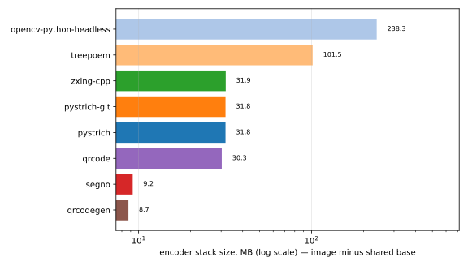
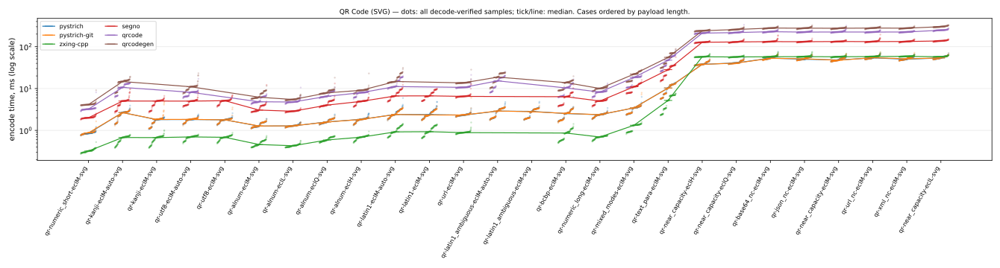

# Barcode encoder benchmark — QR Code

Facts-only report generated by `barcode-bench publish` — one page per symbology. Every table's ordering and highlighting rule is stated in its caption; narrative and interpretation live elsewhere.

- Run: `20260716T001407Z-seed1102692623` generated 2026-07-16T00:14:07.948613+00:00
- Corpus: seed 1102692623, 26 QR Code PNG cases (each mirrored as an SVG twin), 5 trial payloads per case × 20 timed rounds = 100 samples per case per encoder
- Environment: containers on `Linux-6.8.0-124-generic-x86_64-with-glibc2.36`, one image per encoder over a shared `python:3.12-slim-bookworm` base
- CPU: `Intel(R) Core(TM) i7-8550U CPU @ 1.80GHz` (8 logical cores)

Encoder labels use the exact PyPI distribution name; the **PyPI package** column links each project. `pystrich-git` is a wheel built from GitHub HEAD, not a release.

| encoder | PyPI package | libraries | image id |
|---|---|---|---|
| pystrich | [pystrich](https://pypi.org/project/pystrich/) | pystrich 0.17, pillow 12.3.0 | `87bcd36acc39` |
| pystrich-git | [pyStrich@HEAD](https://github.com/mmulqueen/pyStrich) (git build, not a release) | pystrich@git d3f1cd4f907d, pillow 12.3.0 | `1e53f9422f28` |
| zxing-cpp | [zxing-cpp](https://pypi.org/project/zxing-cpp/) | zxing-cpp 3.1.0, pillow 12.3.0 | `46d59b65b551` |
| segno | [segno](https://pypi.org/project/segno/) | segno 1.6.6 | `244023e8030c` |
| qrcode | [qrcode](https://pypi.org/project/qrcode/) | qrcode 8.2, pillow 12.3.0 | `e91cbf49da91` |
| qrcodegen | [qrcodegen](https://pypi.org/project/qrcodegen/) | qrcodegen 1.8.0 | `27d28fc01489` |
| opencv-python-headless | [opencv-python-headless](https://pypi.org/project/opencv-python-headless/) | opencv-python-headless 5.0.0.93 | `df9bb5794599` |
| treepoem | [treepoem](https://pypi.org/project/treepoem/) | treepoem 3.28.0, pillow 12.3.0, ghostscript 10.00.0 | `d5bb6dff3cd6` |

## Correctness and coverage

Cases by outcome for this symbology, PNG and SVG axes shown separately: *ok* = every trial decode-verified against its payload (zxing-cpp; SVG rasterised host-side first); *partial* = some trials raised; *misdecode* = the symbol was produced but the reference decoder read it back as different content (a charset-ambiguous byte-mode symbol, say); *err* = every trial raised; *unsup.* = options the encoder cannot honour. Non-ok outcomes are listed under [Exceptions](#exceptions). *Verified symbols* counts decode-verified (symbol, trial) pairs across the PNG and SVG axes.

| encoder | PNG | SVG | verified symbols |
|---|---|---|---:|
| pystrich | 26 ok | 26 ok | 260 |
| pystrich-git | 26 ok | 26 ok | 260 |
| zxing-cpp | 24 ok, 2 misdecode | 24 ok, 2 misdecode | 240 |
| segno | 24 ok, 2 misdecode | 24 ok, 2 misdecode | 240 |
| qrcode | 22 ok, 4 unsup. | 22 ok, 4 unsup. | 220 |
| qrcodegen | 26 unsup. | 22 ok, 4 unsup. | 110 |
| opencv-python-headless | 26 ok | 26 unsup. | 130 |
| treepoem | 22 ok, 4 unsup. | 26 unsup. | 110 |

## Installation size and startup

Encoder stack = full image size minus the shared Python base — i.e. the library plus every dependency it installs, **including Pillow** where the encoder renders through it (segno writes its own PNG/SVG and needs none). Sorted by stack size. Import time is the median of cold interpreter starts inside the container. Footprint is a property of the library, not the symbology; the chart shows the whole field for context.



| encoder | stack MB | full image MB | cold import ms |
|---|---:|---:|---:|
| qrcodegen | 8.7 | 146.6 | 18.5 |
| segno | 9.2 | 147.6 | 35.7 |
| qrcode | 30.3 | 189.6 | 56.4 |
| pystrich | 31.8 | 192.7 | 35.9 |
| pystrich-git | 31.8 | 192.7 | 36.1 |
| zxing-cpp | 31.9 | 192.9 | 32.2 |
| treepoem | 101.5 | 332.1 | 33.2 |
| opencv-python-headless | 238.3 | 605.7 | 113 |

## Encode time (PNG)


Median ms of decode-verified samples, rows ordered by payload length. **Bold** = row minimum. `†` = some trials were excluded from the median (raised at encode, or the symbol misdecoded) — see [Exceptions](#exceptions) for which and why. `ERR` = every trial failed (raised, or the symbol misdecoded); `—` = not attempted (unsupported). Chart dots are individual samples (trials × rounds); the tick/line is the median. treepoem's timings include a ghostscript subprocess per encode — part of its cost of use, not an artefact.

| case | payload (chars) | pystrich | pystrich-git | zxing-cpp | segno | qrcode | opencv-python-headless | treepoem |
|---|---|---:|---:|---:|---:|---:|---:|---:|
| `qr-numeric_short-eclM` | numeric_short (9) | 1.14 | 1.14 | **0.55** | 2.30 | 2.28 | 6.27 | 2,345 |
| `qr-kanji-eclM` | kanji (28) | 2.08 | 2.02 | **0.77** | 5.45 | — | 13.9 | 2,370 |
| `qr-kanji-eclM-auto` | kanji (28) | 2.85 | 2.89 | **0.76** | 5.67 | 8.14 | 13.9 | — |
| `qr-utf8-eclM` | utf8 (33) | 2.04 | 2.03 | **0.81** | 5.47 | — | 10.1 | 2,362 |
| `qr-utf8-eclM-auto` | utf8 (33) | 2.01 | 2.01 | **0.81** | 5.67 | 5.99 | 10.1 | — |
| `qr-alnum-eclM` | alnum (36) | 1.80 | 1.77 | **0.69** | 3.32 | 3.37 | 5.86 | 2,356 |
| `qr-alnum-eclL` | alnum (43) | 1.55 | 1.50 | **0.64** | 3.19 | 3.36 | 5.53 | 2,341 |
| `qr-alnum-eclQ` | alnum (45) | 2.19 | 2.16 | **0.78** | 4.45 | 4.59 | 8.38 | 2,373 |
| `qr-alnum-eclH` | alnum (46) | 2.22 | 2.21 | **0.90** | 5.37 | 5.62 | 10.5 | 2,369 |
| `qr-latin1-eclM` | latin1 (78) | 2.68 | 2.60 | **0.99** | 7.21 | — | 14.1 | 2,412 |
| `qr-latin1-eclM-auto` | latin1 (78) | 2.60 | 2.63 | **0.98** | 7.56 | 8.19 | 14.1 | — |
| `qr-url-eclM` | url (78) | 2.64 | 2.60 | **1.05** | 6.95 | 7.69 | 13.7 | 2,412 |
| `qr-latin1_ambiguous-eclM` | latin1_ambiguous (89) | 3.23 | **3.18** | ERR | ERR | — | 21.3 | 2,423 |
| `qr-latin1_ambiguous-eclM-auto` | latin1_ambiguous (89) | **3.06** | 3.09 | ERR | ERR | 11.4 | 21.3 | — |
| `qr-bcbp-eclM` | bcbp (97) | 2.80 | 2.75 | **0.95** | 7.08 | 7.82 | 13.3 | 2,401 |
| `qr-numeric_long-eclM` | numeric_long (113) | 2.91 | 2.90 | **0.91** | 5.54 | 5.86 | 12.5 | 2,363 |
| `qr-mixed_modes-eclM` | mixed_modes (144) | 3.99 | 3.94 | **1.38** | 11.8 | 13.3 | 25.9 | 2,419 |
| `qr-text_para-eclM` | text_para (381) | 13.9 | 13.9 | **3.74** | 29.9 | 34.6 | 71.3 | 2,590 |
| `qr-near_capacity-eclH` | near_capacity (1082) | 40.8 | 40.9 | **14.2** | 138 | 158 | 341 | 3,576 |
| `qr-near_capacity-eclQ` | near_capacity (1413) | 45.1 | 44.7 | **14.3** | 138 | 163 | 340 | 3,818 |
| `qr-base64_nc-eclM` | base64_near_capacity (1980) | 60.0 | 59.7 | **14.4** | 145 | 174 | 339 | 4,334 |
| `qr-json_nc-eclM` | json_near_capacity (1981) | 54.1 | 54.2 | **14.3** | 143 | 173 | 340 | 3,454 |
| `qr-near_capacity-eclM` | near_capacity (1981) | 51.9 | 51.3 | **14.3** | 143 | 167 | 339 | 4,336 |
| `qr-url_nc-eclM` | url_near_capacity (1981) | 57.1 | 58.7 | **14.6** | 146 | 173 | 339 | 4,350 |
| `qr-xml_nc-eclM` | xml_near_capacity (1981) | 52.8 | 52.8 | **14.4** | 142 | 173 | 341 | 3,462 |
| `qr-near_capacity-eclL` | near_capacity (2510) | 60.7 | 60.8 | **14.5** | 145 | 189 | 341 | 4,950 |

## Encode time (SVG)



Same conventions and columns as the PNG table above, for SVG output — the *same case set*. Each SVG is rasterised host-side (rsvg-convert, outside the timed region) only for the validity gate, so the timing is the encoder's vector write alone.

| case | payload (chars) | pystrich | pystrich-git | zxing-cpp | segno | qrcode | qrcodegen |
|---|---|---:|---:|---:|---:|---:|---:|
| `qr-numeric_short-eclM-svg` | numeric_short (9) | 0.85 | 0.87 | **0.32** | 2.00 | 3.22 | 4.13 |
| `qr-kanji-eclM-auto-svg` | kanji (28) | 2.67 | 2.65 | **0.67** | 5.02 | 10.6 | 14.7 |
| `qr-kanji-eclM-svg` | kanji (28) | 1.80 | 1.82 | **0.67** | 5.02 | — | — |
| `qr-utf8-eclM-auto-svg` | utf8 (33) | 1.82 | 1.83 | **0.70** | 5.00 | 8.13 | 11.0 |
| `qr-utf8-eclM-svg` | utf8 (33) | 1.79 | 1.79 | **0.68** | 5.12 | — | — |
| `qr-alnum-eclM-svg` | alnum (36) | 1.26 | 1.27 | **0.46** | 3.06 | 4.82 | 6.20 |
| `qr-alnum-eclL-svg` | alnum (43) | 1.28 | 1.28 | **0.43** | 2.87 | 4.77 | 5.47 |
| `qr-alnum-eclQ-svg` | alnum (45) | 1.59 | 1.58 | **0.59** | 4.02 | 6.52 | 7.89 |
| `qr-alnum-eclH-svg` | alnum (46) | 1.83 | 1.83 | **0.69** | 4.93 | 7.97 | 9.08 |
| `qr-latin1-eclM-auto-svg` | latin1 (78) | 2.40 | 2.40 | **0.92** | 6.65 | 11.1 | 14.7 |
| `qr-latin1-eclM-svg` | latin1 (78) | 2.38 | 2.33 | **0.93** | 6.69 | — | — |
| `qr-url-eclM-svg` | url (78) | 2.31 | 2.33 | **0.88** | 6.49 | 10.7 | 13.7 |
| `qr-latin1_ambiguous-eclM-auto-svg` | latin1_ambiguous (89) | **2.89** | 2.90 | ERR | ERR | 15.3 | 18.7 |
| `qr-latin1_ambiguous-eclM-svg` | latin1_ambiguous (89) | 2.84 | **2.79** | ERR | ERR | — | — |
| `qr-bcbp-eclM-svg` | bcbp (97) | 2.52 | 2.54 | **0.86** | 6.37 | 10.3 | 13.9 |
| `qr-numeric_long-eclM-svg` | numeric_long (113) | 2.37 | 2.37 | **0.69** | 5.03 | 8.23 | 10.0 |
| `qr-mixed_modes-eclM-svg` | mixed_modes (144) | 3.45 | 3.45 | **1.32** | 11.1 | 18.5 | 22.1 |
| `qr-text_para-eclM-svg` | text_para (381) | 10.3 | 10.3 | **5.20** | 28.2 | 47.6 | 55.6 |
| `qr-near_capacity-eclH-svg` | near_capacity (1082) | 37.8 | **37.7** | 57.4 | 128 | 211 | 240 |
| `qr-near_capacity-eclQ-svg` | near_capacity (1413) | 40.9 | **40.6** | 56.9 | 130 | 218 | 258 |
| `qr-base64_nc-eclM-svg` | base64_near_capacity (1980) | 53.3 | **52.8** | 57.5 | 132 | 229 | 279 |
| `qr-json_nc-eclM-svg` | json_near_capacity (1981) | **50.1** | 51.5 | 58.0 | 132 | 224 | 278 |
| `qr-near_capacity-eclM-svg` | near_capacity (1981) | 48.2 | **47.4** | 57.4 | 133 | 225 | 276 |
| `qr-url_nc-eclM-svg` | url_near_capacity (1981) | **54.0** | 54.6 | 58.2 | 132 | 224 | 279 |
| `qr-xml_nc-eclM-svg` | xml_near_capacity (1981) | **50.2** | 51.4 | 58.8 | 133 | 225 | 277 |
| `qr-near_capacity-eclL-svg` | near_capacity (2510) | **53.8** | 53.8 | 57.4 | 138 | 248 | 301 |

## Symbol size

Median module footprint (modules² excluding quiet zones), measured from the rendered symbol's module grid — render scale and quiet zones cancel out, so every encoder is on the same scale. **Bold** = row minimum; percentages are overhead vs it. Only decode-verified symbols are measured: `ERR` = every trial failed (raised, or the symbol misdecoded — see [Exceptions](#exceptions)); `—` = not attempted (unsupported); `†` = measured over a subset of trials (the rest raised or misdecoded). Sizes for qrcodegen are measured from their decoded SVG (SVG-only libraries; the symbol is identical to the PNG a raster encoder would emit).

| case | pystrich | pystrich-git | zxing-cpp | segno | qrcode | qrcodegen | opencv-python-headless | treepoem |
|---|---:|---:|---:|---:|---:|---:|---:|---:|
| `qr-numeric_short-eclM` | **441** | **441** | **441** | **441** | **441** | **441** | **441** | **441** |
| `qr-kanji-eclM` | **1,089** | **1,089** | **1,089** | **1,089** | — | — | 1,369 (+26%) | **1,089** |
| `qr-kanji-eclM-auto` | 1,681 (+54%) | 1,681 (+54%) | **1,089** | **1,089** | 1,369 (+26%) | 1,369 (+26%) | 1,369 (+26%) | — |
| `qr-utf8-eclM` | **1,089** | **1,089** | **1,089** | **1,089** | — | — | **1,089** | **1,089** |
| `qr-utf8-eclM-auto` | **1,089** | **1,089** | **1,089** | **1,089** | **1,089** | **1,089** | **1,089** | — |
| `qr-alnum-eclM` | **625** | **625** | **625** | **625** | **625** | **625** | **625** | **625** |
| `qr-alnum-eclL` | **625** | **625** | **625** | **625** | **625** | **625** | **625** | **625** |
| `qr-alnum-eclQ` | **841** | **841** | **841** | **841** | **841** | **841** | **841** | **841** |
| `qr-alnum-eclH` | **1,089** | **1,089** | **1,089** | **1,089** | **1,089** | **1,089** | **1,089** | **1,089** |
| `qr-latin1-eclM` | **1,369** | **1,369** | **1,369** | **1,369** | — | — | **1,369** | **1,369** |
| `qr-latin1-eclM-auto` | **1,369** | **1,369** | **1,369** | **1,369** | **1,369** | **1,369** | **1,369** | — |
| `qr-url-eclM` | **1,369** | **1,369** | **1,369** | **1,369** | **1,369** | **1,369** | **1,369** | **1,369** |
| `qr-latin1_ambiguous-eclM` | **1,681** | **1,681** | ERR | ERR | — | — | 2,025 (+20%) | **1,681** |
| `qr-latin1_ambiguous-eclM-auto` | **1,681** | **1,681** | ERR | ERR | 2,025 (+20%) | 2,025 (+20%) | 2,025 (+20%) | — |
| `qr-bcbp-eclM` | **1,369** | **1,369** | **1,369** | **1,369** | **1,369** | **1,369** | **1,369** | **1,369** |
| `qr-numeric_long-eclM` | **1,089** | **1,089** | **1,089** | **1,089** | **1,089** | **1,089** | **1,089** | **1,089** |
| `qr-mixed_modes-eclM` | **2,025** | **2,025** | **2,025** | 2,401 (+19%) | 2,401 (+19%) | 2,401 (+19%) | 2,401 (+19%) | **2,025** |
| `qr-text_para-eclM` | **5,929** | **5,929** | **5,929** | **5,929** | **5,929** | **5,929** | **5,929** | **5,929** |
| `qr-near_capacity-eclH` | **27,225** | **27,225** | **27,225** | **27,225** | **27,225** | **27,225** | **27,225** | **27,225** |
| `qr-near_capacity-eclQ` | **27,225** | **27,225** | **27,225** | **27,225** | **27,225** | **27,225** | **27,225** | **27,225** |
| `qr-base64_nc-eclM` | **27,225** | **27,225** | **27,225** | **27,225** | **27,225** | **27,225** | **27,225** | **27,225** |
| `qr-json_nc-eclM` | **27,225** | **27,225** | **27,225** | **27,225** | **27,225** | **27,225** | **27,225** | **27,225** |
| `qr-near_capacity-eclM` | **27,225** | **27,225** | **27,225** | **27,225** | **27,225** | **27,225** | **27,225** | **27,225** |
| `qr-url_nc-eclM` | **27,225** | **27,225** | **27,225** | **27,225** | **27,225** | **27,225** | **27,225** | **27,225** |
| `qr-xml_nc-eclM` | **27,225** | **27,225** | **27,225** | **27,225** | **27,225** | **27,225** | **27,225** | **27,225** |
| `qr-near_capacity-eclL` | **27,225** | **27,225** | **27,225** | **27,225** | **27,225** | **27,225** | **27,225** | **27,225** |

## Exceptions

Every non-ok outcome for this symbology: unsupported options and encode errors carry the recorded reason verbatim; a *misdecode* (the symbol was produced but failed the decode-verify gate) shows how it failed.

| encoder | case | outcome | trials | reason |
|---|---|---|---:|---|
| opencv-python-headless | `qr-alnum-eclH-svg` | unsupported | 20 | no native SVG writer |
| opencv-python-headless | `qr-alnum-eclL-svg` | unsupported | 20 | no native SVG writer |
| opencv-python-headless | `qr-alnum-eclM-svg` | unsupported | 20 | no native SVG writer |
| opencv-python-headless | `qr-alnum-eclQ-svg` | unsupported | 20 | no native SVG writer |
| opencv-python-headless | `qr-base64_nc-eclM-svg` | unsupported | 20 | no native SVG writer |
| opencv-python-headless | `qr-bcbp-eclM-svg` | unsupported | 20 | no native SVG writer |
| opencv-python-headless | `qr-json_nc-eclM-svg` | unsupported | 20 | no native SVG writer |
| opencv-python-headless | `qr-kanji-eclM-auto-svg` | unsupported | 20 | no native SVG writer |
| opencv-python-headless | `qr-kanji-eclM-svg` | unsupported | 20 | no native SVG writer |
| opencv-python-headless | `qr-latin1-eclM-auto-svg` | unsupported | 20 | no native SVG writer |
| opencv-python-headless | `qr-latin1-eclM-svg` | unsupported | 20 | no native SVG writer |
| opencv-python-headless | `qr-latin1_ambiguous-eclM-auto-svg` | unsupported | 20 | no native SVG writer |
| opencv-python-headless | `qr-latin1_ambiguous-eclM-svg` | unsupported | 20 | no native SVG writer |
| opencv-python-headless | `qr-mixed_modes-eclM-svg` | unsupported | 20 | no native SVG writer |
| opencv-python-headless | `qr-near_capacity-eclH-svg` | unsupported | 20 | no native SVG writer |
| opencv-python-headless | `qr-near_capacity-eclL-svg` | unsupported | 20 | no native SVG writer |
| opencv-python-headless | `qr-near_capacity-eclM-svg` | unsupported | 20 | no native SVG writer |
| opencv-python-headless | `qr-near_capacity-eclQ-svg` | unsupported | 20 | no native SVG writer |
| opencv-python-headless | `qr-numeric_long-eclM-svg` | unsupported | 20 | no native SVG writer |
| opencv-python-headless | `qr-numeric_short-eclM-svg` | unsupported | 20 | no native SVG writer |
| opencv-python-headless | `qr-text_para-eclM-svg` | unsupported | 20 | no native SVG writer |
| opencv-python-headless | `qr-url-eclM-svg` | unsupported | 20 | no native SVG writer |
| opencv-python-headless | `qr-url_nc-eclM-svg` | unsupported | 20 | no native SVG writer |
| opencv-python-headless | `qr-utf8-eclM-auto-svg` | unsupported | 20 | no native SVG writer |
| opencv-python-headless | `qr-utf8-eclM-svg` | unsupported | 20 | no native SVG writer |
| opencv-python-headless | `qr-xml_nc-eclM-svg` | unsupported | 20 | no native SVG writer |
| qrcode | `qr-kanji-eclM` | unsupported | 20 | no charset/ECI support for 'shift_jis' payloads |
| qrcode | `qr-kanji-eclM-svg` | unsupported | 20 | no charset/ECI support for 'shift_jis' payloads |
| qrcode | `qr-latin1-eclM` | unsupported | 20 | no charset/ECI support for 'iso-8859-1' payloads |
| qrcode | `qr-latin1-eclM-svg` | unsupported | 20 | no charset/ECI support for 'iso-8859-1' payloads |
| qrcode | `qr-latin1_ambiguous-eclM` | unsupported | 20 | no charset/ECI support for 'iso-8859-1' payloads |
| qrcode | `qr-latin1_ambiguous-eclM-svg` | unsupported | 20 | no charset/ECI support for 'iso-8859-1' payloads |
| qrcode | `qr-utf8-eclM` | unsupported | 20 | no charset/ECI support for 'utf-8' payloads |
| qrcode | `qr-utf8-eclM-svg` | unsupported | 20 | no charset/ECI support for 'utf-8' payloads |
| qrcodegen | `qr-alnum-eclH` | unsupported | 20 | no documented raster output (vector-only library) |
| qrcodegen | `qr-alnum-eclL` | unsupported | 20 | no documented raster output (vector-only library) |
| qrcodegen | `qr-alnum-eclM` | unsupported | 20 | no documented raster output (vector-only library) |
| qrcodegen | `qr-alnum-eclQ` | unsupported | 20 | no documented raster output (vector-only library) |
| qrcodegen | `qr-base64_nc-eclM` | unsupported | 20 | no documented raster output (vector-only library) |
| qrcodegen | `qr-bcbp-eclM` | unsupported | 20 | no documented raster output (vector-only library) |
| qrcodegen | `qr-json_nc-eclM` | unsupported | 20 | no documented raster output (vector-only library) |
| qrcodegen | `qr-kanji-eclM` | unsupported | 20 | no documented raster output (vector-only library) |
| qrcodegen | `qr-kanji-eclM-auto` | unsupported | 20 | no documented raster output (vector-only library) |
| qrcodegen | `qr-kanji-eclM-svg` | unsupported | 20 | no charset/ECI support for 'shift_jis' payloads |
| qrcodegen | `qr-latin1-eclM` | unsupported | 20 | no documented raster output (vector-only library) |
| qrcodegen | `qr-latin1-eclM-auto` | unsupported | 20 | no documented raster output (vector-only library) |
| qrcodegen | `qr-latin1-eclM-svg` | unsupported | 20 | no charset/ECI support for 'iso-8859-1' payloads |
| qrcodegen | `qr-latin1_ambiguous-eclM` | unsupported | 20 | no documented raster output (vector-only library) |
| qrcodegen | `qr-latin1_ambiguous-eclM-auto` | unsupported | 20 | no documented raster output (vector-only library) |
| qrcodegen | `qr-latin1_ambiguous-eclM-svg` | unsupported | 20 | no charset/ECI support for 'iso-8859-1' payloads |
| qrcodegen | `qr-mixed_modes-eclM` | unsupported | 20 | no documented raster output (vector-only library) |
| qrcodegen | `qr-near_capacity-eclH` | unsupported | 20 | no documented raster output (vector-only library) |
| qrcodegen | `qr-near_capacity-eclL` | unsupported | 20 | no documented raster output (vector-only library) |
| qrcodegen | `qr-near_capacity-eclM` | unsupported | 20 | no documented raster output (vector-only library) |
| qrcodegen | `qr-near_capacity-eclQ` | unsupported | 20 | no documented raster output (vector-only library) |
| qrcodegen | `qr-numeric_long-eclM` | unsupported | 20 | no documented raster output (vector-only library) |
| qrcodegen | `qr-numeric_short-eclM` | unsupported | 20 | no documented raster output (vector-only library) |
| qrcodegen | `qr-text_para-eclM` | unsupported | 20 | no documented raster output (vector-only library) |
| qrcodegen | `qr-url-eclM` | unsupported | 20 | no documented raster output (vector-only library) |
| qrcodegen | `qr-url_nc-eclM` | unsupported | 20 | no documented raster output (vector-only library) |
| qrcodegen | `qr-utf8-eclM` | unsupported | 20 | no documented raster output (vector-only library) |
| qrcodegen | `qr-utf8-eclM-auto` | unsupported | 20 | no documented raster output (vector-only library) |
| qrcodegen | `qr-utf8-eclM-svg` | unsupported | 20 | no charset/ECI support for 'utf-8' payloads |
| qrcodegen | `qr-xml_nc-eclM` | unsupported | 20 | no documented raster output (vector-only library) |
| segno | `qr-latin1_ambiguous-eclM` | misdecode | 5 | 5 decoded to different content (read back e.g. `77ｱ6ｰC ､51 30ｱ6ｰC ｣ 61ｱ5ｰC ､17 35ｱ4ｰC ｽ …`) |
| segno | `qr-latin1_ambiguous-eclM-auto` | misdecode | 5 | 5 decoded to different content (read back e.g. `77ｱ6ｰC ､51 30ｱ6ｰC ｣ 61ｱ5ｰC ､17 35ｱ4ｰC ｽ …`) |
| segno | `qr-latin1_ambiguous-eclM-auto-svg` | misdecode | 5 | 5 decoded to different content (read back e.g. `77ｱ6ｰC ､51 30ｱ6ｰC ｣ 61ｱ5ｰC ､17 35ｱ4ｰC ｽ …`) |
| segno | `qr-latin1_ambiguous-eclM-svg` | misdecode | 5 | 5 decoded to different content (read back e.g. `77ｱ6ｰC ､51 30ｱ6ｰC ｣ 61ｱ5ｰC ､17 35ｱ4ｰC ｽ …`) |
| treepoem | `qr-alnum-eclH-svg` | unsupported | 20 | no native SVG writer |
| treepoem | `qr-alnum-eclL-svg` | unsupported | 20 | no native SVG writer |
| treepoem | `qr-alnum-eclM-svg` | unsupported | 20 | no native SVG writer |
| treepoem | `qr-alnum-eclQ-svg` | unsupported | 20 | no native SVG writer |
| treepoem | `qr-base64_nc-eclM-svg` | unsupported | 20 | no native SVG writer |
| treepoem | `qr-bcbp-eclM-svg` | unsupported | 20 | no native SVG writer |
| treepoem | `qr-json_nc-eclM-svg` | unsupported | 20 | no native SVG writer |
| treepoem | `qr-kanji-eclM-auto` | unsupported | 20 | cannot take non-ASCII text without a declared charset |
| treepoem | `qr-kanji-eclM-auto-svg` | unsupported | 20 | no native SVG writer |
| treepoem | `qr-kanji-eclM-svg` | unsupported | 20 | no native SVG writer |
| treepoem | `qr-latin1-eclM-auto` | unsupported | 20 | cannot take non-ASCII text without a declared charset |
| treepoem | `qr-latin1-eclM-auto-svg` | unsupported | 20 | no native SVG writer |
| treepoem | `qr-latin1-eclM-svg` | unsupported | 20 | no native SVG writer |
| treepoem | `qr-latin1_ambiguous-eclM-auto` | unsupported | 20 | cannot take non-ASCII text without a declared charset |
| treepoem | `qr-latin1_ambiguous-eclM-auto-svg` | unsupported | 20 | no native SVG writer |
| treepoem | `qr-latin1_ambiguous-eclM-svg` | unsupported | 20 | no native SVG writer |
| treepoem | `qr-mixed_modes-eclM-svg` | unsupported | 20 | no native SVG writer |
| treepoem | `qr-near_capacity-eclH-svg` | unsupported | 20 | no native SVG writer |
| treepoem | `qr-near_capacity-eclL-svg` | unsupported | 20 | no native SVG writer |
| treepoem | `qr-near_capacity-eclM-svg` | unsupported | 20 | no native SVG writer |
| treepoem | `qr-near_capacity-eclQ-svg` | unsupported | 20 | no native SVG writer |
| treepoem | `qr-numeric_long-eclM-svg` | unsupported | 20 | no native SVG writer |
| treepoem | `qr-numeric_short-eclM-svg` | unsupported | 20 | no native SVG writer |
| treepoem | `qr-text_para-eclM-svg` | unsupported | 20 | no native SVG writer |
| treepoem | `qr-url-eclM-svg` | unsupported | 20 | no native SVG writer |
| treepoem | `qr-url_nc-eclM-svg` | unsupported | 20 | no native SVG writer |
| treepoem | `qr-utf8-eclM-auto` | unsupported | 20 | cannot take non-ASCII text without a declared charset |
| treepoem | `qr-utf8-eclM-auto-svg` | unsupported | 20 | no native SVG writer |
| treepoem | `qr-utf8-eclM-svg` | unsupported | 20 | no native SVG writer |
| treepoem | `qr-xml_nc-eclM-svg` | unsupported | 20 | no native SVG writer |
| zxing-cpp | `qr-latin1_ambiguous-eclM` | misdecode | 5 | 5 decoded to different content (read back e.g. `77ｱ6ｰC ､51 30ｱ6ｰC ｣ 61ｱ5ｰC ､17 35ｱ4ｰC ｽ …`) |
| zxing-cpp | `qr-latin1_ambiguous-eclM-auto` | misdecode | 5 | 5 decoded to different content (read back e.g. `77ｱ6ｰC ､51 30ｱ6ｰC ｣ 61ｱ5ｰC ､17 35ｱ4ｰC ｽ …`) |
| zxing-cpp | `qr-latin1_ambiguous-eclM-auto-svg` | misdecode | 5 | 5 decoded to different content (read back e.g. `77ｱ6ｰC ､51 30ｱ6ｰC ｣ 61ｱ5ｰC ､17 35ｱ4ｰC ｽ …`) |
| zxing-cpp | `qr-latin1_ambiguous-eclM-svg` | misdecode | 5 | 5 decoded to different content (read back e.g. `77ｱ6ｰC ､51 30ｱ6ｰC ｣ 61ｱ5ｰC ､17 35ｱ4ｰC ｽ …`) |

## Methodology

- **One corpus, all encoders.** Payloads are generated once per run from a seeded RNG and materialised to `corpus.json`; every encoder receives the identical byte-for-byte payloads. The same seed reproduces the corpus exactly.
- **Same environment.** Every encoder runs in its own podman image over the same pinned Python base; libraries install from PyPI as published (except `pystrich-git`, a wheel from GitHub HEAD).
- **What is timed.** The full operation *payload string → encode → image on disk*, `perf_counter`, after one untimed warm-up per option shape. Import cost is excluded and measured separately (cold-import column). Each encoder renders through the writer its own documentation shows; a library that documents no raster path runs the SVG axis only rather than being forced through a foreign shim (noted per encoder in the run's capability notes).
- **Same cases, both formats.** Every PNG case has an SVG twin with byte-identical payloads. SVG rasterisation and measurement happen host-side, outside the timed region, so SVG timing is the encoder's vector write alone; the module footprint is identical for a case and its SVG twin, so it is reported once.
- **Validity gate.** Every produced image (PNG, or SVG rasterised host-side) is decoded with zxing-cpp and compared to its payload; samples from failed round-trips are excluded from all statistics.
- **Explicit options, never degraded.** Cases request explicit EC levels / charsets; an encoder that cannot honour a knob is recorded *unsupported* rather than silently re-configured.

## Limitations

Not measured: print/scan robustness or decode margins, output file size (PNG compression / SVG verbosity), memory use, concurrency, or cross-platform variation. Timings are sequential on one machine — treat small differences accordingly; the charts draw every raw sample so the spread is visible.

Symbol area is quantised: a symbol is the smallest standard size that fits its payload, so differences smaller than one size tier don't appear in the tables.

treepoem shells out to ghostscript once per encode; its timings are orders of magnitude larger by construction — the cost of that approach, kept in the tables rather than hidden.

Benchmark authored by the maintainer of pyStrich; the corpus and validity rules are encoder-neutral and the raw records ship alongside this report.

## Reproduction

```sh
uv run barcode-bench all --seed 1102692623 --trials 5
```

Raw records alongside this report: [`corpus.json`](corpus.json), [`summary.csv`](summary.csv), [`measurements.jsonl`](measurements.jsonl), [`images.json`](images.json).
