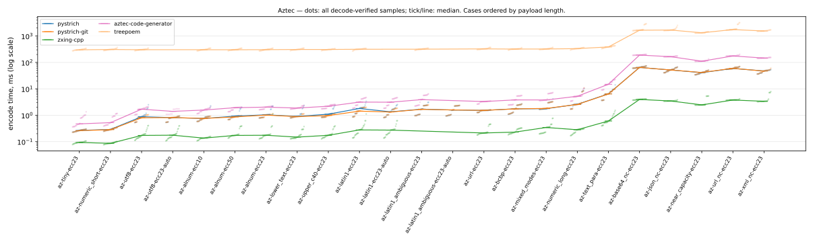
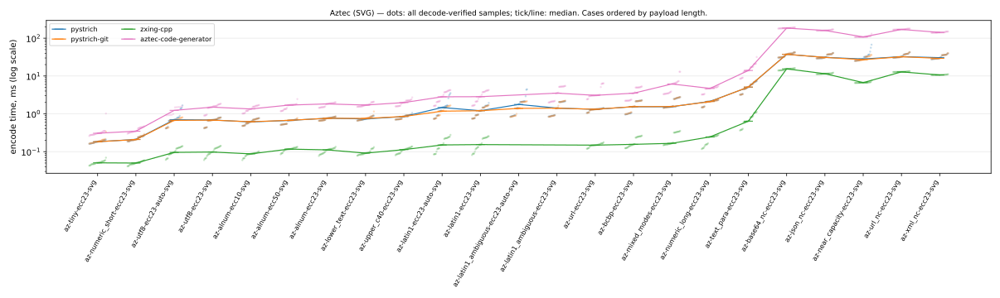

# Barcode encoder benchmark — Aztec

Facts-only report generated by [`barcode-bench publish`](https://github.com/Method-B-Ltd/barcode-bench) — one page per symbology. Every table's ordering and highlighting rule is stated in its caption; narrative and interpretation live elsewhere.

- Run: `20260730T221612Z-seed725059` generated 2026-07-30T22:16:12.748552+00:00
- Corpus: seed 725059, 23 Aztec PNG cases (each mirrored as an SVG twin), 5 trial payloads per case × 5 timed rounds = 25 samples per case per encoder
- Environment: containers on `Linux-7.0.0-28-generic-x86_64-with-glibc2.36`, one image per encoder over a shared `python:3.12-slim-bookworm` base
- CPU: `AMD Ryzen AI 9 HX 370 w/ Radeon 890M` (24 logical cores)

Encoder labels use the exact PyPI distribution name; the **PyPI package** column links each project. `pystrich-git` is a wheel built from GitHub HEAD, not a release.

| encoder | PyPI package | libraries | image id |
|---|---|---|---|
| pystrich | [pystrich](https://pypi.org/project/pystrich/) | pystrich 0.19, pillow 12.3.0 | `ba8fec8cad32` |
| pystrich-git | [pyStrich@HEAD](https://github.com/mmulqueen/pyStrich) (git build, not a release) | pystrich@git 2362f6652978, pillow 12.3.0 | `19e582931615` |
| zxing-cpp | [zxing-cpp](https://pypi.org/project/zxing-cpp/) | zxing-cpp 3.1.1, pillow 12.3.0 | `ff3e163314b8` |
| aztec-code-generator | [aztec-code-generator](https://pypi.org/project/aztec-code-generator/) | aztec-code-generator 0.12, pillow 12.3.0 | `8f50b9ba609c` |
| treepoem | [treepoem](https://pypi.org/project/treepoem/) | treepoem 3.28.0, pillow 12.3.0, ghostscript 10.00.0 | `0e048434d255` |

## Correctness and coverage

Cases by outcome for this symbology, PNG and SVG axes shown separately: *ok* = every trial decode-verified against its payload (zxing-cpp; SVG rasterised host-side first); *partial* = some trials raised; *misdecode* = the symbol was produced but the reference decoder read it back as different content (a charset-ambiguous byte-mode symbol, say); *err* = every trial raised; *unsup.* = options the encoder cannot honour. Non-ok outcomes are listed under [Exceptions](#exceptions). *Verified symbols* counts decode-verified (symbol, trial) pairs across the PNG and SVG axes.

| encoder | PNG | SVG | verified symbols |
|---|---|---|---:|
| pystrich | 23 ok | 23 ok | 230 |
| pystrich-git | 23 ok | 23 ok | 230 |
| zxing-cpp | 21 ok, 2 misdecode | 21 ok, 2 misdecode | 210 |
| aztec-code-generator | 21 ok, 1 partial, 1 misdecode | 21 ok, 1 partial, 1 misdecode | 214 |
| treepoem | 20 ok, 3 unsup. | 23 unsup. | 100 |

## Installation size and startup

Encoder stack = full image size minus the shared Python base — i.e. the library plus every dependency it installs, **including Pillow** where the encoder renders through it (segno writes its own PNG/SVG and needs none). Sorted by stack size. Import time is the median of cold interpreter starts inside the container. Footprint is a property of the library, not the symbology; the chart shows the whole field for context.


| encoder | stack MB | full image MB | cold import ms |
|---|---:|---:|---:|
| aztec-code-generator | 29.8 | 158.9 | 23.2 |
| pystrich | 31.7 | 160.8 | 19.0 |
| pystrich-git | 31.7 | 160.8 | 19.3 |
| zxing-cpp | 31.8 | 160.9 | 18.1 |
| treepoem | 101.3 | 230.4 | 22.2 |

## Encode time (PNG)



Median ms of decode-verified samples, rows ordered by payload length. **Bold** = row minimum. `†` = some trials were excluded from the median (raised at encode, or the symbol misdecoded) — see [Exceptions](#exceptions) for which and why. `ERR` = every trial failed (raised, or the symbol misdecoded); `—` = not attempted (unsupported). Chart dots are individual samples (trials × rounds); the tick/line is the median. treepoem's timings include a ghostscript subprocess per encode — part of its cost of use, not an artefact.

| case | payload (chars) | pystrich | pystrich-git | zxing-cpp | aztec-code-generator | treepoem |
|---|---|---:|---:|---:|---:|---:|
| `az-tiny-ecc23` | tiny (4) | 0.27 | 0.26 | **0.09** | 0.47 | 300 |
| `az-numeric_short-ecc23` | numeric_short (7) | 0.29 | 0.28 | **0.09** | 0.52 | 309 |
| `az-utf8-ecc23` | utf8 (32) | 0.88 | 0.80 | **0.17** | 1.69 | 302 |
| `az-utf8-ecc23-auto` | utf8 (32) | 0.81 | 0.82 | **0.18** | 1.40 † | — |
| `az-alnum-ecc10` | alnum (33) | 0.75 | 0.76 | **0.14** | 1.57 | 302 |
| `az-alnum-ecc50` | alnum (37) | 0.92 | 0.86 | **0.17** | 1.93 | 301 |
| `az-alnum-ecc23` | alnum (44) | 1.04 | 1.01 | **0.17** | 2.03 | 304 |
| `az-lower_text-ecc23` | lower_text (50) | 0.90 | 0.88 | **0.15** | 1.87 | 309 |
| `az-upper_c40-ecc23` | upper_c40 (50) | 1.10 | 0.97 | **0.17** | 2.19 | 309 |
| `az-latin1-ecc23` | latin1 (70) | 1.80 | 1.43 | **0.28** | 3.14 | 315 |
| `az-latin1-ecc23-auto` | latin1 (70) | 1.34 | 1.32 | **0.27** | 3.12 | — |
| `az-latin1_ambiguous-ecc23` | latin1_ambiguous (72) | 1.70 | **1.67** | ERR | 3.90 | 317 |
| `az-latin1_ambiguous-ecc23-auto` | latin1_ambiguous (72) | **1.58** | 1.58 | ERR | ERR | — |
| `az-url-ecc23` | url (81) | 1.52 | 1.53 | **0.21** | 3.30 | 325 |
| `az-bcbp-ecc23` | bcbp (97) | 1.75 | 1.74 | **0.23** | 3.80 | 320 |
| `az-mixed_modes-ecc23` | mixed_modes (99) | 1.77 | 1.81 | **0.34** | 3.78 | 322 |
| `az-numeric_long-ecc23` | numeric_long (129) | 2.59 | 2.56 | **0.28** | 5.23 | 333 |
| `az-text_para-ecc23` | text_para (337) | 6.46 | 6.38 | **0.61** | 14.9 | 386 |
| `az-base64_nc-ecc23` | base64_near_capacity (1624) | 64.6 | 64.4 | **3.97** | 190 | 1,654 |
| `az-json_nc-ecc23` | json_near_capacity (1626) | 51.6 | 51.6 | **3.46** | 165 | 1,683 |
| `az-near_capacity-ecc23` | near_capacity (1626) | 40.9 | 41.5 | **2.46** | 111 | 1,322 |
| `az-url_nc-ecc23` | url_near_capacity (1626) | 59.1 | 59.7 | **3.77** | 176 | 1,753 |
| `az-xml_nc-ecc23` | xml_near_capacity (1626) | 47.5 | 46.9 | **3.37** | 146 | 1,548 |

## Encode time (SVG)



Same conventions and columns as the PNG table above, for SVG output — the *same case set*. Each SVG is rasterised host-side (rsvg-convert, outside the timed region) only for the validity gate, so the timing is the encoder's vector write alone.

| case | payload (chars) | pystrich | pystrich-git | zxing-cpp | aztec-code-generator |
|---|---|---:|---:|---:|---:|
| `az-tiny-ecc23-svg` | tiny (4) | 0.18 | 0.18 | **0.05** | 0.31 |
| `az-numeric_short-ecc23-svg` | numeric_short (7) | 0.21 | 0.21 | **0.05** | 0.35 |
| `az-utf8-ecc23-auto-svg` | utf8 (32) | 0.70 | 0.67 | **0.10** | 1.23 † |
| `az-utf8-ecc23-svg` | utf8 (32) | 0.69 | 0.68 | **0.10** | 1.50 |
| `az-alnum-ecc10-svg` | alnum (33) | 0.61 | 0.62 | **0.09** | 1.34 |
| `az-alnum-ecc50-svg` | alnum (37) | 0.67 | 0.67 | **0.12** | 1.70 |
| `az-alnum-ecc23-svg` | alnum (44) | 0.77 | 0.76 | **0.11** | 1.83 |
| `az-lower_text-ecc23-svg` | lower_text (50) | 0.73 | 0.76 | **0.09** | 1.70 |
| `az-upper_c40-ecc23-svg` | upper_c40 (50) | 0.85 | 0.85 | **0.11** | 1.98 |
| `az-latin1-ecc23-auto-svg` | latin1 (70) | 1.47 | 1.18 | **0.15** | 2.82 |
| `az-latin1-ecc23-svg` | latin1 (70) | 1.21 | 1.21 | **0.15** | 2.84 |
| `az-latin1_ambiguous-ecc23-auto-svg` | latin1_ambiguous (72) | 1.77 | **1.39** | ERR | ERR |
| `az-latin1_ambiguous-ecc23-svg` | latin1_ambiguous (72) | 1.42 | **1.41** | ERR | 3.52 |
| `az-url-ecc23-svg` | url (81) | 1.32 | 1.32 | **0.15** | 3.08 |
| `az-bcbp-ecc23-svg` | bcbp (97) | 1.54 | 1.55 | **0.16** | 3.51 |
| `az-mixed_modes-ecc23-svg` | mixed_modes (99) | 1.54 | 1.56 | **0.17** | 6.15 |
| `az-numeric_long-ecc23-svg` | numeric_long (129) | 2.13 | 2.10 | **0.25** | 4.69 |
| `az-text_para-ecc23-svg` | text_para (337) | 5.07 | 5.12 | **0.64** | 14.0 |
| `az-base64_nc-ecc23-svg` | base64_near_capacity (1624) | 37.5 | 37.4 | **15.4** | 185 |
| `az-json_nc-ecc23-svg` | json_near_capacity (1626) | 31.1 | 31.0 | **11.5** | 160 |
| `az-near_capacity-ecc23-svg` | near_capacity (1626) | 28.2 | 27.0 | **6.68** | 108 |
| `az-url_nc-ecc23-svg` | url_near_capacity (1626) | 32.5 | 32.3 | **12.9** | 170 |
| `az-xml_nc-ecc23-svg` | xml_near_capacity (1626) | 30.6 | 29.3 | **10.6** | 142 |

## Symbol size

Median module footprint (modules² excluding quiet zones), measured from the rendered symbol's module grid — render scale and quiet zones cancel out, so every encoder is on the same scale. A full-range Aztec's footprint includes its reference-grid lines, so it can exceed a compact symbol of similar data capacity. **Bold** = row minimum; percentages are overhead vs it. Only decode-verified symbols are measured: `ERR` = every trial failed (raised, or the symbol misdecoded — see [Exceptions](#exceptions)); `—` = not attempted (unsupported); `†` = measured over a subset of trials (the rest raised or misdecoded).

| case | pystrich | pystrich-git | zxing-cpp | aztec-code-generator | treepoem |
|---|---:|---:|---:|---:|---:|
| `az-tiny-ecc23` | **225** | **225** | **225** | **225** | 361 (+60%) |
| `az-numeric_short-ecc23` | **225** | **225** | **225** | **225** | 361 (+60%) |
| `az-utf8-ecc23` | **529** | **529** | **529** | **529** | 729 (+38%) |
| `az-utf8-ecc23-auto` | 529 (+19%) | 529 (+19%) | 529 (+19%) | **445** † | — |
| `az-alnum-ecc10` | **529** | **529** | **529** | **529** | 729 (+38%) |
| `az-alnum-ecc50` | **729** | **729** | **729** | **729** | 961 (+32%) |
| `az-alnum-ecc23` | **729** | **729** | **729** | **729** | **729** |
| `az-lower_text-ecc23` | **529** | **529** | **529** | **529** | 729 (+38%) |
| `az-upper_c40-ecc23` | **729** | **729** | **729** | **729** | **729** |
| `az-latin1-ecc23` | **961** | **961** | **961** | **961** | **961** |
| `az-latin1-ecc23-auto` | **961** | **961** | **961** | **961** | — |
| `az-latin1_ambiguous-ecc23` | **1,369** | **1,369** | ERR | **1,369** | **1,369** |
| `az-latin1_ambiguous-ecc23-auto` | **1,369** | **1,369** | ERR | ERR | — |
| `az-url-ecc23` | **961** | **961** | **961** | **961** | **961** |
| `az-bcbp-ecc23` | **961** | **961** | **961** | **961** | **961** |
| `az-mixed_modes-ecc23` | **961** | **961** | **961** | **961** | **961** |
| `az-numeric_long-ecc23` | **1,369** | **1,369** | **1,369** | **1,369** | **1,369** |
| `az-text_para-ecc23` | **2,809** | **2,809** | **2,809** | **2,809** | **2,809** |
| `az-base64_nc-ecc23` | **19,321** | **19,321** | 20,449 (+6%) | **19,321** | **19,321** |
| `az-json_nc-ecc23` | **17,161** | **17,161** | 18,225 (+6%) | **17,161** | **17,161** |
| `az-near_capacity-ecc23` | **12,769** | **12,769** | **12,769** | **12,769** | **12,769** |
| `az-url_nc-ecc23` | **18,225** | **18,225** | 19,321 (+6%) | **18,225** | **18,225** |
| `az-xml_nc-ecc23` | **15,625** | **15,625** | 17,161 (+10%) | **15,625** | **15,625** |

## Exceptions

Every non-ok outcome for this symbology: unsupported options and encode errors carry the recorded reason verbatim; a *misdecode* (the symbol was produced but failed the decode-verify gate) shows how it failed.

| encoder | case | outcome | trials | reason |
|---|---|---|---:|---|
| aztec-code-generator | `az-latin1_ambiguous-ecc23-auto` | misdecode | 5 | 5 decoded to different content (read back e.g. `ｿ ･14093 ･318 ･71293 ｫ ｣ 66ｱ2ｰC street 8…`) |
| aztec-code-generator | `az-latin1_ambiguous-ecc23-auto-svg` | misdecode | 5 | 5 decoded to different content (read back e.g. `ｿ ･14093 ･318 ･71293 ｫ ｣ 66ｱ2ｰC street 8…`) |
| aztec-code-generator | `az-utf8-ecc23-auto` | encode_error | 15 | UnicodeEncodeError: 'latin-1' codec can't encode character '\u2192' in position 8: ordinal not in range(256) |
| aztec-code-generator | `az-utf8-ecc23-auto-svg` | encode_error | 15 | UnicodeEncodeError: 'latin-1' codec can't encode character '\u2192' in position 8: ordinal not in range(256) |
| treepoem | `az-alnum-ecc10-svg` | unsupported | 5 | no native SVG writer |
| treepoem | `az-alnum-ecc23-svg` | unsupported | 5 | no native SVG writer |
| treepoem | `az-alnum-ecc50-svg` | unsupported | 5 | no native SVG writer |
| treepoem | `az-base64_nc-ecc23-svg` | unsupported | 5 | no native SVG writer |
| treepoem | `az-bcbp-ecc23-svg` | unsupported | 5 | no native SVG writer |
| treepoem | `az-json_nc-ecc23-svg` | unsupported | 5 | no native SVG writer |
| treepoem | `az-latin1-ecc23-auto` | unsupported | 5 | cannot take non-ASCII text without a declared charset |
| treepoem | `az-latin1-ecc23-auto-svg` | unsupported | 5 | no native SVG writer |
| treepoem | `az-latin1-ecc23-svg` | unsupported | 5 | no native SVG writer |
| treepoem | `az-latin1_ambiguous-ecc23-auto` | unsupported | 5 | cannot take non-ASCII text without a declared charset |
| treepoem | `az-latin1_ambiguous-ecc23-auto-svg` | unsupported | 5 | no native SVG writer |
| treepoem | `az-latin1_ambiguous-ecc23-svg` | unsupported | 5 | no native SVG writer |
| treepoem | `az-lower_text-ecc23-svg` | unsupported | 5 | no native SVG writer |
| treepoem | `az-mixed_modes-ecc23-svg` | unsupported | 5 | no native SVG writer |
| treepoem | `az-near_capacity-ecc23-svg` | unsupported | 5 | no native SVG writer |
| treepoem | `az-numeric_long-ecc23-svg` | unsupported | 5 | no native SVG writer |
| treepoem | `az-numeric_short-ecc23-svg` | unsupported | 5 | no native SVG writer |
| treepoem | `az-text_para-ecc23-svg` | unsupported | 5 | no native SVG writer |
| treepoem | `az-tiny-ecc23-svg` | unsupported | 5 | no native SVG writer |
| treepoem | `az-upper_c40-ecc23-svg` | unsupported | 5 | no native SVG writer |
| treepoem | `az-url-ecc23-svg` | unsupported | 5 | no native SVG writer |
| treepoem | `az-url_nc-ecc23-svg` | unsupported | 5 | no native SVG writer |
| treepoem | `az-utf8-ecc23-auto` | unsupported | 5 | cannot take non-ASCII text without a declared charset |
| treepoem | `az-utf8-ecc23-auto-svg` | unsupported | 5 | no native SVG writer |
| treepoem | `az-utf8-ecc23-svg` | unsupported | 5 | no native SVG writer |
| treepoem | `az-xml_nc-ecc23-svg` | unsupported | 5 | no native SVG writer |
| zxing-cpp | `az-latin1_ambiguous-ecc23` | misdecode | 5 | 5 decoded to different content (read back e.g. `ｿ ･14093 ･318 ･71293 ｫ ｣ 66ｱ2ｰC street 8…`) |
| zxing-cpp | `az-latin1_ambiguous-ecc23-auto` | misdecode | 5 | 5 decoded to different content (read back e.g. `ｿ ･14093 ･318 ･71293 ｫ ｣ 66ｱ2ｰC street 8…`) |
| zxing-cpp | `az-latin1_ambiguous-ecc23-auto-svg` | misdecode | 5 | 5 decoded to different content (read back e.g. `ｿ ･14093 ･318 ･71293 ｫ ｣ 66ｱ2ｰC street 8…`) |
| zxing-cpp | `az-latin1_ambiguous-ecc23-svg` | misdecode | 5 | 5 decoded to different content (read back e.g. `ｿ ･14093 ･318 ･71293 ｫ ｣ 66ｱ2ｰC street 8…`) |

## Methodology

- **One corpus, all encoders.** Payloads are generated once per run from a seeded RNG and materialised to `corpus.json`; every encoder receives the identical byte-for-byte payloads. The same seed reproduces the corpus exactly.
- **Same environment.** Every encoder runs in its own podman image over the same pinned Python base; libraries install from PyPI as published (except `pystrich-git`, a wheel from GitHub HEAD).
- **What is timed.** The full operation *payload string → encode → image on disk*, `perf_counter`, after one untimed warm-up per option shape. Import cost is excluded and measured separately (cold-import column). Each encoder renders through the writer its own documentation shows; a library that documents no raster path runs the SVG axis only rather than being forced through a foreign shim (noted per encoder in the run's capability notes).
- **Same cases, both formats.** Every PNG case has an SVG twin with byte-identical payloads. SVG rasterisation and measurement happen host-side, outside the timed region, so SVG timing is the encoder's vector write alone; the module footprint is identical for a case and its SVG twin, so it is reported once.
- **Validity gate.** Every produced image (PNG, or SVG rasterised host-side) is decoded with zxing-cpp and compared to its payload; samples from failed round-trips are excluded from all statistics.
- **Explicit options, never degraded.** Cases request explicit EC levels / charsets; an encoder that cannot honour a knob is recorded *unsupported* rather than silently re-configured.
- **Aztec EC is a floor.** The requested error-correction percentage is a minimum; a symbol with slack capacity carries more, so decoders report a higher percentage than requested — expected, not an error.

## Limitations

Not measured: print/scan robustness or decode margins, output file size (PNG compression / SVG verbosity), memory use, concurrency, or cross-platform variation. Timings are sequential on one machine — treat small differences accordingly; the charts draw every raw sample so the spread is visible.

Symbol area is quantised: a symbol is the smallest standard size that fits its payload, so differences smaller than one size tier don't appear in the tables.

treepoem shells out to ghostscript once per encode; its timings are orders of magnitude larger by construction — the cost of that approach, kept in the tables rather than hidden.

Benchmark authored by the maintainer of pyStrich; the corpus and validity rules are encoder-neutral and the raw records ship alongside this report.

## Reproduction

Benchmark source: [Method-B-Ltd/barcode-bench](https://github.com/Method-B-Ltd/barcode-bench).

```sh
uv run barcode-bench all --seed 725059 --trials 5
```

Raw records alongside this report: [`corpus.json`](corpus.json), [`summary.csv`](summary.csv), [`measurements.jsonl`](measurements.jsonl), [`images.json`](images.json).
