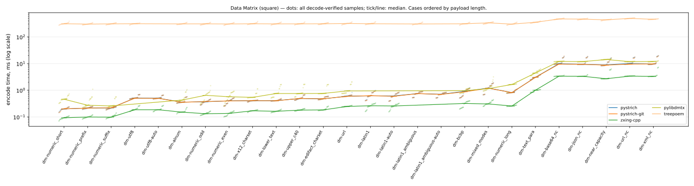
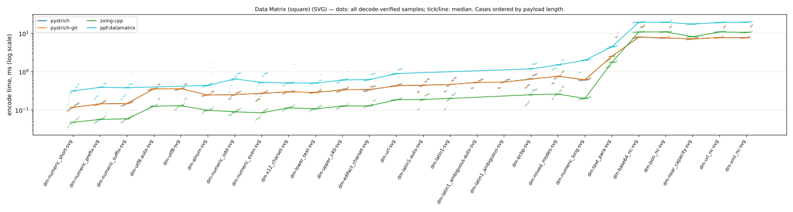

# Barcode encoder benchmark — Data Matrix (square)

Facts-only report generated by [`barcode-bench publish`](https://github.com/Method-B-Ltd/barcode-bench) — one page per symbology. Every table's ordering and highlighting rule is stated in its caption; narrative and interpretation live elsewhere.

- Run: `20260730T221612Z-seed725059` generated 2026-07-30T22:16:12.748552+00:00
- Corpus: seed 725059, 26 Data Matrix (square) PNG cases (each mirrored as an SVG twin), 5 trial payloads per case × 5 timed rounds = 25 samples per case per encoder
- Environment: containers on `Linux-7.0.0-28-generic-x86_64-with-glibc2.36`, one image per encoder over a shared `python:3.12-slim-bookworm` base
- CPU: `AMD Ryzen AI 9 HX 370 w/ Radeon 890M` (24 logical cores)

Encoder labels use the exact PyPI distribution name; the **PyPI package** column links each project. `pystrich-git` is a wheel built from GitHub HEAD, not a release.

| encoder | PyPI package | libraries | image id |
|---|---|---|---|
| pystrich | [pystrich](https://pypi.org/project/pystrich/) | pystrich 0.19, pillow 12.3.0 | `ba8fec8cad32` |
| pystrich-git | [pyStrich@HEAD](https://github.com/mmulqueen/pyStrich) (git build, not a release) | pystrich@git 2362f6652978, pillow 12.3.0 | `19e582931615` |
| zxing-cpp | [zxing-cpp](https://pypi.org/project/zxing-cpp/) | zxing-cpp 3.1.1, pillow 12.3.0 | `ff3e163314b8` |
| pylibdmtx | [pylibdmtx](https://pypi.org/project/pylibdmtx/) | pylibdmtx 0.1.10, pillow 12.3.0 | `74a7b5f140c3` |
| ppf-datamatrix | [ppf-datamatrix](https://pypi.org/project/ppf-datamatrix/) | ppf-datamatrix 0.2 | `ac1558a5d700` |
| treepoem | [treepoem](https://pypi.org/project/treepoem/) | treepoem 3.28.0, pillow 12.3.0, ghostscript 10.00.0 | `0e048434d255` |

## Correctness and coverage

Cases by outcome for this symbology, PNG and SVG axes shown separately: *ok* = every trial decode-verified against its payload (zxing-cpp; SVG rasterised host-side first); *partial* = some trials raised; *misdecode* = the symbol was produced but the reference decoder read it back as different content (a charset-ambiguous byte-mode symbol, say); *err* = every trial raised; *unsup.* = options the encoder cannot honour. Non-ok outcomes are listed under [Exceptions](#exceptions). *Verified symbols* counts decode-verified (symbol, trial) pairs across the PNG and SVG axes.

| encoder | PNG | SVG | verified symbols |
|---|---|---|---:|
| pystrich | 26 ok | 26 ok | 260 |
| pystrich-git | 26 ok | 26 ok | 260 |
| zxing-cpp | 24 ok, 2 misdecode | 24 ok, 2 misdecode | 240 |
| pylibdmtx | 20 ok, 6 unsup. | 26 unsup. | 100 |
| ppf-datamatrix | 26 unsup. | 20 ok, 6 unsup. | 100 |
| treepoem | 23 ok, 3 unsup. | 26 unsup. | 115 |

## Installation size and startup

Encoder stack = full image size minus the shared Python base — i.e. the library plus every dependency it installs, **including Pillow** where the encoder renders through it (segno writes its own PNG/SVG and needs none). Sorted by stack size. Import time is the median of cold interpreter starts inside the container. Footprint is a property of the library, not the symbology; the chart shows the whole field for context.


| encoder | stack MB | full image MB | cold import ms |
|---|---:|---:|---:|
| ppf-datamatrix | 8.6 | 137.7 | 13.0 |
| pystrich | 31.7 | 160.8 | 19.0 |
| pystrich-git | 31.7 | 160.8 | 19.3 |
| zxing-cpp | 31.8 | 160.9 | 18.1 |
| pylibdmtx | 38.9 | 168.0 | 84.9 |
| treepoem | 101.3 | 230.4 | 22.2 |

## Encode time (PNG)



Median ms of decode-verified samples, rows ordered by payload length. **Bold** = row minimum. `†` = some trials were excluded from the median (raised at encode, or the symbol misdecoded) — see [Exceptions](#exceptions) for which and why. `ERR` = every trial failed (raised, or the symbol misdecoded); `—` = not attempted (unsupported). Chart dots are individual samples (trials × rounds); the tick/line is the median. treepoem's timings include a ghostscript subprocess per encode — part of its cost of use, not an artefact.

| case | payload (chars) | pystrich | pystrich-git | zxing-cpp | pylibdmtx | treepoem |
|---|---|---:|---:|---:|---:|---:|
| `dm-numeric_short` | numeric_short (8) | 0.20 | 0.20 | **0.09** | 0.46 | 310 |
| `dm-numeric_prefix` | numeric_prefix (15) | 0.21 | 0.21 | **0.10** | 0.27 | 301 |
| `dm-numeric_suffix` | numeric_suffix (17) | 0.22 | 0.22 | **0.10** | 0.26 | 307 |
| `dm-utf8` | utf8 (28) | 0.51 | 0.50 | **0.19** | — | 311 |
| `dm-utf8-auto` | utf8 (28) | 0.50 | 0.50 | **0.19** | — | — |
| `dm-alnum` | alnum (33) | 0.36 | 0.35 | **0.15** | 0.43 | 306 |
| `dm-numeric_odd` | numeric_odd (37) | 0.37 | 0.38 | **0.13** | 0.64 | 308 |
| `dm-numeric_even` | numeric_even (42) | 0.40 | 0.40 | **0.14** | 0.57 | 303 |
| `dm-x12_charset` | x12_charset (46) | 0.40 | 0.41 | **0.17** | 0.54 | 310 |
| `dm-lower_text` | lower_text (48) | 0.41 | 0.40 | **0.16** | 0.75 | 306 |
| `dm-upper_c40` | upper_c40 (54) | 0.49 | 0.49 | **0.18** | 0.75 | 308 |
| `dm-edifact_charset` | edifact_charset (56) | 0.47 | 0.48 | **0.18** | 0.76 | 309 |
| `dm-url` | url (65) | 0.60 | 0.59 | **0.25** | 0.94 | 318 |
| `dm-latin1` | latin1 (72) | 0.62 | 0.62 | **0.26** | — | 311 |
| `dm-latin1-auto` | latin1 (72) | 0.61 | 0.59 | **0.26** | — | — |
| `dm-latin1_ambiguous` | latin1_ambiguous (79) | 0.75 | **0.75** | ERR | — | 304 |
| `dm-latin1_ambiguous-auto` | latin1_ambiguous (79) | 0.71 | **0.70** | ERR | — | — |
| `dm-bcbp` | bcbp (97) | 0.91 | 0.87 | **0.32** | 0.96 | 309 |
| `dm-mixed_modes` | mixed_modes (117) | 1.21 | 1.19 | **0.31** | 1.15 | 335 |
| `dm-numeric_long` | numeric_long (117) | 0.81 | 0.82 | **0.26** | 1.64 | 301 |
| `dm-text_para` | text_para (421) | 3.06 | 3.04 | **1.00** | 4.42 | 352 |
| `dm-base64_nc` | base64_near_capacity (1320) | 9.91 | 9.56 | **3.36** | 12.0 | 470 |
| `dm-json_nc` | json_near_capacity (1322) | 9.33 | 9.35 | **3.34** | 11.8 | 463 |
| `dm-near_capacity` | near_capacity (1322) | 8.97 | 8.72 | **2.69** | 14.2 | 435 |
| `dm-url_nc` | url_near_capacity (1322) | 10.0 | 9.55 | **3.38** | 11.8 | 493 |
| `dm-xml_nc` | xml_near_capacity (1322) | 9.72 | 9.68 | **3.30** | 11.9 | 455 |

## Encode time (SVG)



Same conventions and columns as the PNG table above, for SVG output — the *same case set*. Each SVG is rasterised host-side (rsvg-convert, outside the timed region) only for the validity gate, so the timing is the encoder's vector write alone.

| case | payload (chars) | pystrich | pystrich-git | zxing-cpp | ppf-datamatrix |
|---|---|---:|---:|---:|---:|
| `dm-numeric_short-svg` | numeric_short (8) | 0.12 | 0.12 | **0.05** | 0.31 |
| `dm-numeric_prefix-svg` | numeric_prefix (15) | 0.14 | 0.14 | **0.06** | 0.39 |
| `dm-numeric_suffix-svg` | numeric_suffix (17) | 0.15 | 0.15 | **0.06** | 0.38 |
| `dm-utf8-auto-svg` | utf8 (28) | 0.36 | 0.36 | **0.13** | — |
| `dm-utf8-svg` | utf8 (28) | 0.36 | 0.36 | **0.13** | — |
| `dm-alnum-svg` | alnum (33) | 0.25 | 0.25 | **0.10** | 0.44 |
| `dm-numeric_odd-svg` | numeric_odd (37) | 0.25 | 0.25 | **0.09** | 0.65 |
| `dm-numeric_even-svg` | numeric_even (42) | 0.27 | 0.27 | **0.08** | 0.53 |
| `dm-x12_charset-svg` | x12_charset (46) | 0.30 | 0.30 | **0.11** | 0.51 |
| `dm-lower_text-svg` | lower_text (48) | 0.29 | 0.29 | **0.11** | 0.50 |
| `dm-upper_c40-svg` | upper_c40 (54) | 0.34 | 0.33 | **0.13** | 0.61 |
| `dm-edifact_charset-svg` | edifact_charset (56) | 0.34 | 0.35 | **0.13** | 0.62 |
| `dm-url-svg` | url (65) | 0.43 | 0.43 | **0.19** | 0.90 |
| `dm-latin1-auto-svg` | latin1 (72) | 0.45 | 0.44 | **0.19** | — |
| `dm-latin1-svg` | latin1 (72) | 0.46 | 0.46 | **0.20** | — |
| `dm-latin1_ambiguous-auto-svg` | latin1_ambiguous (79) | **0.53** | 0.53 | ERR | — |
| `dm-latin1_ambiguous-svg` | latin1_ambiguous (79) | 0.54 | **0.53** | ERR | — |
| `dm-bcbp-svg` | bcbp (97) | 0.65 | 0.64 | **0.25** | 1.19 |
| `dm-mixed_modes-svg` | mixed_modes (117) | 0.76 | 0.76 | **0.26** | 1.51 |
| `dm-numeric_long-svg` | numeric_long (117) | 0.61 | 0.62 | **0.20** | 1.99 |
| `dm-text_para-svg` | text_para (421) | 2.53 | 2.50 | **1.75** | 4.45 |
| `dm-base64_nc-svg` | base64_near_capacity (1320) | **7.91** | 8.11 | 10.9 | 19.4 |
| `dm-json_nc-svg` | json_near_capacity (1322) | **7.60** | 7.65 | 11.0 | 19.5 |
| `dm-near_capacity-svg` | near_capacity (1322) | **7.13** | 7.19 | 8.16 | 17.5 |
| `dm-url_nc-svg` | url_near_capacity (1322) | **7.78** | 7.78 | 10.9 | 19.3 |
| `dm-xml_nc-svg` | xml_near_capacity (1322) | 7.75 | **7.70** | 10.7 | 19.6 |

## Symbol size

Median module footprint (modules² excluding quiet zones), measured from the rendered symbol's module grid — render scale and quiet zones cancel out, so every encoder is on the same scale. **Bold** = row minimum; percentages are overhead vs it. Only decode-verified symbols are measured: `ERR` = every trial failed (raised, or the symbol misdecoded — see [Exceptions](#exceptions)); `—` = not attempted (unsupported); `†` = measured over a subset of trials (the rest raised or misdecoded). Sizes for ppf-datamatrix are measured from their decoded SVG (SVG-only libraries; the symbol is identical to the PNG a raster encoder would emit).

| case | pystrich | pystrich-git | zxing-cpp | pylibdmtx | ppf-datamatrix | treepoem |
|---|---:|---:|---:|---:|---:|---:|
| `dm-numeric_short` | **144** | **144** | **144** | **144** | **144** | **144** |
| `dm-numeric_prefix` | **196** | **196** | **196** | **196** | **196** | **196** |
| `dm-numeric_suffix` | **256** | **256** | **256** | **256** | **256** | **256** |
| `dm-utf8` | 1,024 (+51%) | 1,024 (+51%) | **676** | — | — | 1,024 (+51%) |
| `dm-utf8-auto` | 1,024 (+51%) | 1,024 (+51%) | **676** | — | — | — |
| `dm-alnum` | **484** | **484** | **484** | **484** | **484** | **484** |
| `dm-numeric_odd` | **400** | **400** | **400** | **400** | **400** | **400** |
| `dm-numeric_even` | **400** | **400** | **400** | **400** | **400** | **400** |
| `dm-x12_charset` | **576** | **576** | **576** | 676 (+17%) | **576** | **576** |
| `dm-lower_text` | **576** | **576** | **576** | 1,024 (+78%) | **576** | **576** |
| `dm-upper_c40` | **676** | **676** | **676** | 1,024 (+51%) | **676** | **676** |
| `dm-edifact_charset` | **676** | **676** | **676** | 1,024 (+51%) | **676** | **676** |
| `dm-url` | **1,024** | **1,024** | **1,024** | **1,024** | **1,024** | **1,024** |
| `dm-latin1` | **1,024** | **1,024** | **1,024** | — | — | 1,296 (+27%) |
| `dm-latin1-auto` | **1,024** | **1,024** | **1,024** | — | — | — |
| `dm-latin1_ambiguous` | **1,296** | **1,296** | ERR | — | — | **1,296** |
| `dm-latin1_ambiguous-auto` | **1,296** | **1,296** | ERR | — | — | — |
| `dm-bcbp` | **1,296** | **1,296** | **1,296** | **1,296** | **1,296** | **1,296** |
| `dm-mixed_modes` | 1,600 (+23%) | 1,600 (+23%) | **1,296** | 1,600 (+23%) | 1,600 (+23%) | **1,296** |
| `dm-numeric_long` | **1,024** | **1,024** | **1,024** | **1,024** | **1,024** | **1,024** |
| `dm-text_para` | **5,184** | **5,184** | **5,184** | 6,400 (+23%) | **5,184** | **5,184** |
| `dm-base64_nc` | **17,424** | **17,424** | **17,424** | **17,424** | **17,424** | **17,424** |
| `dm-json_nc` | **17,424** | **17,424** | **17,424** | **17,424** | **17,424** | **17,424** |
| `dm-near_capacity` | **14,400** | **14,400** | **14,400** | 20,736 (+44%) | **14,400** | **14,400** |
| `dm-url_nc` | **17,424** | **17,424** | **17,424** | **17,424** | **17,424** | **17,424** |
| `dm-xml_nc` | **17,424** | **17,424** | **17,424** | **17,424** | **17,424** | **17,424** |

## Exceptions

Every non-ok outcome for this symbology: unsupported options and encode errors carry the recorded reason verbatim; a *misdecode* (the symbol was produced but failed the decode-verify gate) shows how it failed.

| encoder | case | outcome | trials | reason |
|---|---|---|---:|---|
| ppf-datamatrix | `dm-alnum` | unsupported | 5 | no documented raster output (vector-only library) |
| ppf-datamatrix | `dm-base64_nc` | unsupported | 5 | no documented raster output (vector-only library) |
| ppf-datamatrix | `dm-bcbp` | unsupported | 5 | no documented raster output (vector-only library) |
| ppf-datamatrix | `dm-edifact_charset` | unsupported | 5 | no documented raster output (vector-only library) |
| ppf-datamatrix | `dm-json_nc` | unsupported | 5 | no documented raster output (vector-only library) |
| ppf-datamatrix | `dm-latin1` | unsupported | 5 | no documented raster output (vector-only library) |
| ppf-datamatrix | `dm-latin1-auto` | unsupported | 5 | no documented raster output (vector-only library) |
| ppf-datamatrix | `dm-latin1-auto-svg` | unsupported | 5 | cannot take non-ASCII text without a declared charset |
| ppf-datamatrix | `dm-latin1-svg` | unsupported | 5 | no charset/ECI support for 'iso-8859-1' payloads |
| ppf-datamatrix | `dm-latin1_ambiguous` | unsupported | 5 | no documented raster output (vector-only library) |
| ppf-datamatrix | `dm-latin1_ambiguous-auto` | unsupported | 5 | no documented raster output (vector-only library) |
| ppf-datamatrix | `dm-latin1_ambiguous-auto-svg` | unsupported | 5 | cannot take non-ASCII text without a declared charset |
| ppf-datamatrix | `dm-latin1_ambiguous-svg` | unsupported | 5 | no charset/ECI support for 'iso-8859-1' payloads |
| ppf-datamatrix | `dm-lower_text` | unsupported | 5 | no documented raster output (vector-only library) |
| ppf-datamatrix | `dm-mixed_modes` | unsupported | 5 | no documented raster output (vector-only library) |
| ppf-datamatrix | `dm-near_capacity` | unsupported | 5 | no documented raster output (vector-only library) |
| ppf-datamatrix | `dm-numeric_even` | unsupported | 5 | no documented raster output (vector-only library) |
| ppf-datamatrix | `dm-numeric_long` | unsupported | 5 | no documented raster output (vector-only library) |
| ppf-datamatrix | `dm-numeric_odd` | unsupported | 5 | no documented raster output (vector-only library) |
| ppf-datamatrix | `dm-numeric_prefix` | unsupported | 5 | no documented raster output (vector-only library) |
| ppf-datamatrix | `dm-numeric_short` | unsupported | 5 | no documented raster output (vector-only library) |
| ppf-datamatrix | `dm-numeric_suffix` | unsupported | 5 | no documented raster output (vector-only library) |
| ppf-datamatrix | `dm-text_para` | unsupported | 5 | no documented raster output (vector-only library) |
| ppf-datamatrix | `dm-upper_c40` | unsupported | 5 | no documented raster output (vector-only library) |
| ppf-datamatrix | `dm-url` | unsupported | 5 | no documented raster output (vector-only library) |
| ppf-datamatrix | `dm-url_nc` | unsupported | 5 | no documented raster output (vector-only library) |
| ppf-datamatrix | `dm-utf8` | unsupported | 5 | no documented raster output (vector-only library) |
| ppf-datamatrix | `dm-utf8-auto` | unsupported | 5 | no documented raster output (vector-only library) |
| ppf-datamatrix | `dm-utf8-auto-svg` | unsupported | 5 | cannot take non-ASCII text without a declared charset |
| ppf-datamatrix | `dm-utf8-svg` | unsupported | 5 | no charset/ECI support for 'utf-8' payloads |
| ppf-datamatrix | `dm-x12_charset` | unsupported | 5 | no documented raster output (vector-only library) |
| ppf-datamatrix | `dm-xml_nc` | unsupported | 5 | no documented raster output (vector-only library) |
| pylibdmtx | `dm-alnum-svg` | unsupported | 5 | no native SVG writer |
| pylibdmtx | `dm-base64_nc-svg` | unsupported | 5 | no native SVG writer |
| pylibdmtx | `dm-bcbp-svg` | unsupported | 5 | no native SVG writer |
| pylibdmtx | `dm-edifact_charset-svg` | unsupported | 5 | no native SVG writer |
| pylibdmtx | `dm-json_nc-svg` | unsupported | 5 | no native SVG writer |
| pylibdmtx | `dm-latin1` | unsupported | 5 | no charset/ECI support for 'iso-8859-1' payloads |
| pylibdmtx | `dm-latin1-auto` | unsupported | 5 | cannot take non-ASCII text without a declared charset |
| pylibdmtx | `dm-latin1-auto-svg` | unsupported | 5 | no native SVG writer |
| pylibdmtx | `dm-latin1-svg` | unsupported | 5 | no native SVG writer |
| pylibdmtx | `dm-latin1_ambiguous` | unsupported | 5 | no charset/ECI support for 'iso-8859-1' payloads |
| pylibdmtx | `dm-latin1_ambiguous-auto` | unsupported | 5 | cannot take non-ASCII text without a declared charset |
| pylibdmtx | `dm-latin1_ambiguous-auto-svg` | unsupported | 5 | no native SVG writer |
| pylibdmtx | `dm-latin1_ambiguous-svg` | unsupported | 5 | no native SVG writer |
| pylibdmtx | `dm-lower_text-svg` | unsupported | 5 | no native SVG writer |
| pylibdmtx | `dm-mixed_modes-svg` | unsupported | 5 | no native SVG writer |
| pylibdmtx | `dm-near_capacity-svg` | unsupported | 5 | no native SVG writer |
| pylibdmtx | `dm-numeric_even-svg` | unsupported | 5 | no native SVG writer |
| pylibdmtx | `dm-numeric_long-svg` | unsupported | 5 | no native SVG writer |
| pylibdmtx | `dm-numeric_odd-svg` | unsupported | 5 | no native SVG writer |
| pylibdmtx | `dm-numeric_prefix-svg` | unsupported | 5 | no native SVG writer |
| pylibdmtx | `dm-numeric_short-svg` | unsupported | 5 | no native SVG writer |
| pylibdmtx | `dm-numeric_suffix-svg` | unsupported | 5 | no native SVG writer |
| pylibdmtx | `dm-text_para-svg` | unsupported | 5 | no native SVG writer |
| pylibdmtx | `dm-upper_c40-svg` | unsupported | 5 | no native SVG writer |
| pylibdmtx | `dm-url-svg` | unsupported | 5 | no native SVG writer |
| pylibdmtx | `dm-url_nc-svg` | unsupported | 5 | no native SVG writer |
| pylibdmtx | `dm-utf8` | unsupported | 5 | no charset/ECI support for 'utf-8' payloads |
| pylibdmtx | `dm-utf8-auto` | unsupported | 5 | cannot take non-ASCII text without a declared charset |
| pylibdmtx | `dm-utf8-auto-svg` | unsupported | 5 | no native SVG writer |
| pylibdmtx | `dm-utf8-svg` | unsupported | 5 | no native SVG writer |
| pylibdmtx | `dm-x12_charset-svg` | unsupported | 5 | no native SVG writer |
| pylibdmtx | `dm-xml_nc-svg` | unsupported | 5 | no native SVG writer |
| treepoem | `dm-alnum-svg` | unsupported | 5 | no native SVG writer |
| treepoem | `dm-base64_nc-svg` | unsupported | 5 | no native SVG writer |
| treepoem | `dm-bcbp-svg` | unsupported | 5 | no native SVG writer |
| treepoem | `dm-edifact_charset-svg` | unsupported | 5 | no native SVG writer |
| treepoem | `dm-json_nc-svg` | unsupported | 5 | no native SVG writer |
| treepoem | `dm-latin1-auto` | unsupported | 5 | cannot take non-ASCII text without a declared charset |
| treepoem | `dm-latin1-auto-svg` | unsupported | 5 | no native SVG writer |
| treepoem | `dm-latin1-svg` | unsupported | 5 | no native SVG writer |
| treepoem | `dm-latin1_ambiguous-auto` | unsupported | 5 | cannot take non-ASCII text without a declared charset |
| treepoem | `dm-latin1_ambiguous-auto-svg` | unsupported | 5 | no native SVG writer |
| treepoem | `dm-latin1_ambiguous-svg` | unsupported | 5 | no native SVG writer |
| treepoem | `dm-lower_text-svg` | unsupported | 5 | no native SVG writer |
| treepoem | `dm-mixed_modes-svg` | unsupported | 5 | no native SVG writer |
| treepoem | `dm-near_capacity-svg` | unsupported | 5 | no native SVG writer |
| treepoem | `dm-numeric_even-svg` | unsupported | 5 | no native SVG writer |
| treepoem | `dm-numeric_long-svg` | unsupported | 5 | no native SVG writer |
| treepoem | `dm-numeric_odd-svg` | unsupported | 5 | no native SVG writer |
| treepoem | `dm-numeric_prefix-svg` | unsupported | 5 | no native SVG writer |
| treepoem | `dm-numeric_short-svg` | unsupported | 5 | no native SVG writer |
| treepoem | `dm-numeric_suffix-svg` | unsupported | 5 | no native SVG writer |
| treepoem | `dm-text_para-svg` | unsupported | 5 | no native SVG writer |
| treepoem | `dm-upper_c40-svg` | unsupported | 5 | no native SVG writer |
| treepoem | `dm-url-svg` | unsupported | 5 | no native SVG writer |
| treepoem | `dm-url_nc-svg` | unsupported | 5 | no native SVG writer |
| treepoem | `dm-utf8-auto` | unsupported | 5 | cannot take non-ASCII text without a declared charset |
| treepoem | `dm-utf8-auto-svg` | unsupported | 5 | no native SVG writer |
| treepoem | `dm-utf8-svg` | unsupported | 5 | no native SVG writer |
| treepoem | `dm-x12_charset-svg` | unsupported | 5 | no native SVG writer |
| treepoem | `dm-xml_nc-svg` | unsupported | 5 | no native SVG writer |
| zxing-cpp | `dm-latin1_ambiguous` | misdecode | 5 | 5 decoded to different content (read back e.g. `｣723 95ｱ4ｰC ･5927 70ｱ4ｰC 91ｱ3ｰC ｶ ･74 ci…`) |
| zxing-cpp | `dm-latin1_ambiguous-auto` | misdecode | 5 | 5 decoded to different content (read back e.g. `｣723 95ｱ4ｰC ･5927 70ｱ4ｰC 91ｱ3ｰC ｶ ･74 ci…`) |
| zxing-cpp | `dm-latin1_ambiguous-auto-svg` | misdecode | 5 | 5 decoded to different content (read back e.g. `｣723 95ｱ4ｰC ･5927 70ｱ4ｰC 91ｱ3ｰC ｶ ･74 ci…`) |
| zxing-cpp | `dm-latin1_ambiguous-svg` | misdecode | 5 | 5 decoded to different content (read back e.g. `｣723 95ｱ4ｰC ･5927 70ｱ4ｰC 91ｱ3ｰC ｶ ･74 ci…`) |

## Methodology

- **One corpus, all encoders.** Payloads are generated once per run from a seeded RNG and materialised to `corpus.json`; every encoder receives the identical byte-for-byte payloads. The same seed reproduces the corpus exactly.
- **Same environment.** Every encoder runs in its own podman image over the same pinned Python base; libraries install from PyPI as published (except `pystrich-git`, a wheel from GitHub HEAD).
- **What is timed.** The full operation *payload string → encode → image on disk*, `perf_counter`, after one untimed warm-up per option shape. Import cost is excluded and measured separately (cold-import column). Each encoder renders through the writer its own documentation shows; a library that documents no raster path runs the SVG axis only rather than being forced through a foreign shim (noted per encoder in the run's capability notes).
- **Same cases, both formats.** Every PNG case has an SVG twin with byte-identical payloads. SVG rasterisation and measurement happen host-side, outside the timed region, so SVG timing is the encoder's vector write alone; the module footprint is identical for a case and its SVG twin, so it is reported once.
- **Validity gate.** Every produced image (PNG, or SVG rasterised host-side) is decoded with zxing-cpp and compared to its payload; samples from failed round-trips are excluded from all statistics.
- **Explicit options, never degraded.** Cases request explicit EC levels / charsets; an encoder that cannot honour a knob is recorded *unsupported* rather than silently re-configured.
- **Square symbols.** Data Matrix cases force square symbols so the size comparison measures encodation, not symbol-grid granularity; forced-rectangular Data Matrix is a separate report.

## Limitations

Not measured: print/scan robustness or decode margins, output file size (PNG compression / SVG verbosity), memory use, concurrency, or cross-platform variation. Timings are sequential on one machine — treat small differences accordingly; the charts draw every raw sample so the spread is visible.

Symbol area is quantised: a symbol is the smallest standard size that fits its payload, so differences smaller than one size tier don't appear in the tables.

treepoem shells out to ghostscript once per encode; its timings are orders of magnitude larger by construction — the cost of that approach, kept in the tables rather than hidden.

Benchmark authored by the maintainer of pyStrich; the corpus and validity rules are encoder-neutral and the raw records ship alongside this report.

## Reproduction

Benchmark source: [Method-B-Ltd/barcode-bench](https://github.com/Method-B-Ltd/barcode-bench).

```sh
uv run barcode-bench all --seed 725059 --trials 5
```

Raw records alongside this report: [`corpus.json`](corpus.json), [`summary.csv`](summary.csv), [`measurements.jsonl`](measurements.jsonl), [`images.json`](images.json).
