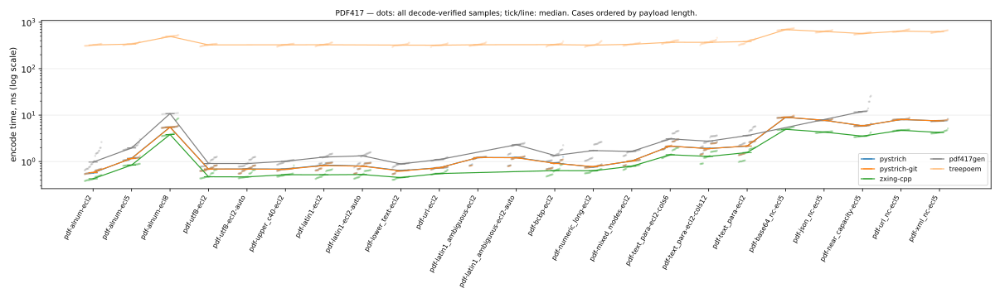
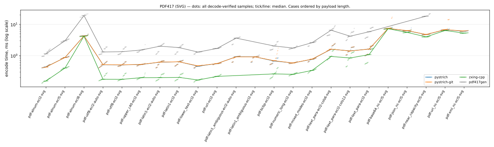

# Barcode encoder benchmark — PDF417

Facts-only report generated by [`barcode-bench publish`](https://github.com/Method-B-Ltd/barcode-bench) — one page per symbology. Every table's ordering and highlighting rule is stated in its caption; narrative and interpretation live elsewhere.

- Run: `20260730T221612Z-seed725059` generated 2026-07-30T22:16:12.748552+00:00
- Corpus: seed 725059, 23 PDF417 PNG cases (each mirrored as an SVG twin), 5 trial payloads per case × 5 timed rounds = 25 samples per case per encoder
- Environment: containers on `Linux-7.0.0-28-generic-x86_64-with-glibc2.36`, one image per encoder over a shared `python:3.12-slim-bookworm` base
- CPU: `AMD Ryzen AI 9 HX 370 w/ Radeon 890M` (24 logical cores)

Encoder labels use the exact PyPI distribution name; the **PyPI package** column links each project. `pystrich-git` is a wheel built from GitHub HEAD, not a release.

| encoder | PyPI package | libraries | image id |
|---|---|---|---|
| pystrich | [pystrich](https://pypi.org/project/pystrich/) | pystrich 0.19, pillow 12.3.0 | `ba8fec8cad32` |
| pystrich-git | [pyStrich@HEAD](https://github.com/mmulqueen/pyStrich) (git build, not a release) | pystrich@git 2362f6652978, pillow 12.3.0 | `19e582931615` |
| zxing-cpp | [zxing-cpp](https://pypi.org/project/zxing-cpp/) | zxing-cpp 3.1.1, pillow 12.3.0 | `ff3e163314b8` |
| pdf417gen | [pdf417gen](https://pypi.org/project/pdf417gen/) | pdf417gen 0.8.1, pillow 12.3.0 | `82c468221aaa` |
| treepoem | [treepoem](https://pypi.org/project/treepoem/) | treepoem 3.28.0, pillow 12.3.0, ghostscript 10.00.0 | `0e048434d255` |

## Correctness and coverage

Cases by outcome for this symbology, PNG and SVG axes shown separately: *ok* = every trial decode-verified against its payload (zxing-cpp; SVG rasterised host-side first); *partial* = some trials raised; *misdecode* = the symbol was produced but the reference decoder read it back as different content (a charset-ambiguous byte-mode symbol, say); *err* = every trial raised; *unsup.* = options the encoder cannot honour. Non-ok outcomes are listed under [Exceptions](#exceptions). *Verified symbols* counts decode-verified (symbol, trial) pairs across the PNG and SVG axes.

| encoder | PNG | SVG | verified symbols |
|---|---|---|---:|
| pystrich | 23 ok | 23 ok | 230 |
| pystrich-git | 23 ok | 23 ok | 230 |
| zxing-cpp | 21 ok, 2 misdecode | 21 ok, 2 misdecode | 210 |
| pdf417gen | 17 ok, 1 partial, 1 misdecode, 4 err | 17 ok, 1 partial, 1 misdecode, 4 err | 174 |
| treepoem | 20 ok, 3 unsup. | 23 unsup. | 100 |

## Installation size and startup

Encoder stack = full image size minus the shared Python base — i.e. the library plus every dependency it installs, **including Pillow** where the encoder renders through it (segno writes its own PNG/SVG and needs none). Sorted by stack size. Import time is the median of cold interpreter starts inside the container. Footprint is a property of the library, not the symbology; the chart shows the whole field for context.


| encoder | stack MB | full image MB | cold import ms |
|---|---:|---:|---:|
| pdf417gen | 29.9 | 159.0 | 33.6 |
| pystrich | 31.7 | 160.8 | 19.0 |
| pystrich-git | 31.7 | 160.8 | 19.3 |
| zxing-cpp | 31.8 | 160.9 | 18.1 |
| treepoem | 101.3 | 230.4 | 22.2 |

## Encode time (PNG)



Median ms of decode-verified samples, rows ordered by payload length. **Bold** = row minimum. `†` = some trials were excluded from the median (raised at encode, or the symbol misdecoded) — see [Exceptions](#exceptions) for which and why. `ERR` = every trial failed (raised, or the symbol misdecoded); `—` = not attempted (unsupported). Chart dots are individual samples (trials × rounds); the tick/line is the median. treepoem's timings include a ghostscript subprocess per encode — part of its cost of use, not an artefact.

| case | payload (chars) | pystrich | pystrich-git | zxing-cpp | pdf417gen | treepoem |
|---|---|---:|---:|---:|---:|---:|
| `pdf-alnum-ecl2` | alnum (32) | 0.57 | 0.58 | **0.42** | 0.97 | 324 |
| `pdf-alnum-ecl5` | alnum (39) | 1.17 | 1.16 | **0.84** | 1.96 | 339 |
| `pdf-alnum-ecl8` | alnum (40) | 5.53 | 5.48 | **3.82** | 10.8 † | 494 |
| `pdf-utf8-ecl2` | utf8 (49) | 0.69 | 0.69 | **0.47** | 0.91 | 326 |
| `pdf-utf8-ecl2-auto` | utf8 (49) | 0.69 | 0.69 | **0.47** | 0.90 | — |
| `pdf-upper_c40-ecl2` | upper_c40 (50) | 0.69 | 0.68 | **0.52** | 1.01 | 326 |
| `pdf-latin1-ecl2` | latin1 (51) | 0.84 | 0.82 | **0.52** | 1.25 | 328 |
| `pdf-latin1-ecl2-auto` | latin1 (51) | 0.80 | 0.79 | **0.52** | 1.33 | — |
| `pdf-lower_text-ecl2` | lower_text (57) | 0.64 | 0.63 | **0.45** | 0.89 | 322 |
| `pdf-url-ecl2` | url (68) | 0.73 | 0.73 | **0.55** | 1.10 | 320 |
| `pdf-latin1_ambiguous-ecl2` | latin1_ambiguous (74) | 1.22 | **1.22** | ERR | ERR | 327 |
| `pdf-latin1_ambiguous-ecl2-auto` | latin1_ambiguous (74) | 1.22 | **1.21** | ERR | 2.30 | — |
| `pdf-bcbp-ecl2` | bcbp (97) | 0.93 | 0.92 | **0.64** | 1.35 | 329 |
| `pdf-numeric_long-ecl2` | numeric_long (126) | 0.76 | 0.77 | **0.63** | 1.72 | 322 |
| `pdf-mixed_modes-ecl2` | mixed_modes (129) | 1.03 | 1.03 | **0.79** | 1.65 | 335 |
| `pdf-text_para-ecl2-cols6` | text_para (304) | 2.14 | 2.15 | **1.40** | 3.08 | 370 |
| `pdf-text_para-ecl2-cols12` | text_para (322) | 1.91 | 1.89 | **1.29** | 2.74 | 369 |
| `pdf-text_para-ecl2` | text_para (357) | 2.15 | 2.16 | **1.56** | 3.62 | 384 |
| `pdf-base64_nc-ecl5` | base64_near_capacity (880) | 8.95 | 9.00 | **4.94** | ERR | 693 |
| `pdf-json_nc-ecl5` | json_near_capacity (880) | 7.75 | 7.74 | **4.31** | ERR | 633 |
| `pdf-near_capacity-ecl5` | near_capacity (880) | 5.87 | 5.89 | **3.52** | 12.0 | 570 |
| `pdf-url_nc-ecl5` | url_near_capacity (880) | 8.05 | 8.05 | **4.71** | ERR | 644 |
| `pdf-xml_nc-ecl5` | xml_near_capacity (880) | 7.51 | 7.53 | **4.23** | ERR | 625 |

## Encode time (SVG)



Same conventions and columns as the PNG table above, for SVG output — the *same case set*. Each SVG is rasterised host-side (rsvg-convert, outside the timed region) only for the validity gate, so the timing is the encoder's vector write alone.

| case | payload (chars) | pystrich | pystrich-git | zxing-cpp | pdf417gen |
|---|---|---:|---:|---:|---:|
| `pdf-alnum-ecl2-svg` | alnum (32) | 0.44 | 0.43 | **0.16** | 1.14 |
| `pdf-alnum-ecl5-svg` | alnum (39) | 0.87 | 0.88 | **0.40** | 3.00 |
| `pdf-alnum-ecl8-svg` | alnum (40) | 4.31 | 4.30 | **4.21** | 19.2 † |
| `pdf-utf8-ecl2-auto-svg` | utf8 (49) | 0.51 | 0.52 | **0.18** | 1.31 |
| `pdf-utf8-ecl2-svg` | utf8 (49) | 0.51 | 0.51 | **0.17** | 1.34 |
| `pdf-upper_c40-ecl2-svg` | upper_c40 (50) | 0.52 | 0.52 | **0.20** | 1.51 |
| `pdf-latin1-ecl2-auto-svg` | latin1 (51) | 0.62 | 0.62 | **0.20** | 2.01 |
| `pdf-latin1-ecl2-svg` | latin1 (51) | 0.64 | 0.64 | **0.20** | 1.81 |
| `pdf-lower_text-ecl2-svg` | lower_text (57) | 0.46 | 0.47 | **0.17** | 1.30 |
| `pdf-url-ecl2-svg` | url (68) | 0.56 | 0.56 | **0.22** | 1.70 |
| `pdf-latin1_ambiguous-ecl2-auto-svg` | latin1_ambiguous (74) | 0.92 | **0.91** | ERR | 3.65 |
| `pdf-latin1_ambiguous-ecl2-svg` | latin1_ambiguous (74) | 0.92 | **0.92** | ERR | ERR |
| `pdf-bcbp-ecl2-svg` | bcbp (97) | 0.67 | 0.69 | **0.26** | 2.04 |
| `pdf-numeric_long-ecl2-svg` | numeric_long (126) | 0.58 | 0.58 | **0.25** | 1.75 |
| `pdf-mixed_modes-ecl2-svg` | mixed_modes (129) | 0.77 | 0.78 | **0.34** | 2.61 |
| `pdf-text_para-ecl2-cols6-svg` | text_para (304) | 1.60 | 1.61 | **0.94** | 6.53 |
| `pdf-text_para-ecl2-cols12-svg` | text_para (322) | 1.43 | 1.41 | **0.84** | 4.20 |
| `pdf-text_para-ecl2-svg` | text_para (357) | 1.63 | 1.62 | **1.08** | 5.83 |
| `pdf-base64_nc-ecl5-svg` | base64_near_capacity (880) | 7.42 | 7.45 | **7.28** | ERR |
| `pdf-json_nc-ecl5-svg` | json_near_capacity (880) | 6.28 | 6.34 | **5.56** | ERR |
| `pdf-near_capacity-ecl5-svg` | near_capacity (880) | 4.74 | 4.77 | **4.00** | 18.4 |
| `pdf-url_nc-ecl5-svg` | url_near_capacity (880) | 6.75 | 6.82 | **6.39** | ERR |
| `pdf-xml_nc-ecl5-svg` | xml_near_capacity (880) | 6.07 | 6.16 | **5.27** | ERR |

## Symbol size

Median module footprint (modules² excluding quiet zones), measured from the rendered symbol's module grid — render scale and quiet zones cancel out, so every encoder is on the same scale. PDF417 rows carry ~69 modules of start/stop/indicator overhead each and render 3 modules tall, so a layout with fewer data columns but more rows can still be larger in area. **Bold** = row minimum; percentages are overhead vs it. Only decode-verified symbols are measured: `ERR` = every trial failed (raised, or the symbol misdecoded — see [Exceptions](#exceptions)); `—` = not attempted (unsupported); `†` = measured over a subset of trials (the rest raised or misdecoded).

| case | pystrich | pystrich-git | zxing-cpp | pdf417gen | treepoem |
|---|---:|---:|---:|---:|---:|
| `pdf-alnum-ecl2` | 3,288 (+7%) | 3,288 (+7%) | 3,960 (+29%) | **3,078** | 3,960 (+29%) |
| `pdf-alnum-ecl5` | **7,170** | **7,170** | 8,208 (+14%) | 8,208 (+14%) | 8,208 (+14%) |
| `pdf-alnum-ecl8` | **32,604** | **32,604** | 36,540 (+12%) | 45,913 (+41%) † | 36,540 (+12%) |
| `pdf-utf8-ecl2` | 4,158 (+16%) | 4,158 (+16%) | 4,320 (+20%) | **3,591** | 4,680 (+30%) |
| `pdf-utf8-ecl2-auto` | 4,158 (+16%) | 4,158 (+16%) | 4,320 (+20%) | **3,591** | — |
| `pdf-upper_c40-ecl2` | **4,104** | **4,104** | 4,680 (+14%) | **4,104** | 4,680 (+14%) |
| `pdf-latin1-ecl2` | 5,076 (+3%) | 5,076 (+3%) | **4,932** | 5,130 (+4%) | 5,343 (+8%) |
| `pdf-latin1-ecl2-auto` | 5,076 (+3%) | 5,076 (+3%) | **4,932** | 5,643 (+14%) | — |
| `pdf-lower_text-ecl2` | 3,696 (+3%) | 3,696 (+3%) | 4,110 (+14%) | **3,591** | 4,110 (+14%) |
| `pdf-url-ecl2` | **4,512** | **4,512** | 5,343 (+18%) | 4,617 (+2%) | 5,343 (+18%) |
| `pdf-latin1_ambiguous-ecl2` | 7,887 (+14%) | 7,887 (+14%) | ERR | ERR | **6,930** |
| `pdf-latin1_ambiguous-ecl2-auto` | **7,887** | **7,887** | ERR | 10,260 (+30%) | — |
| `pdf-bcbp-ecl2` | **5,535** | **5,535** | 6,006 (+9%) | 5,643 (+2%) | 6,006 (+9%) |
| `pdf-numeric_long-ecl2` | **4,512** | **4,512** | 5,754 (+28%) | 4,617 (+2%) | 5,754 (+28%) |
| `pdf-mixed_modes-ecl2` | **6,150** | **6,150** | 7,392 (+20%) | 7,182 (+17%) | 7,392 (+20%) |
| `pdf-text_para-ecl2-cols6` | **14,364** | **14,364** | **14,364** | **14,364** | **14,364** |
| `pdf-text_para-ecl2-cols12` | **12,285** | **12,285** | **12,285** | **12,285** | **12,285** |
| `pdf-text_para-ecl2` | **13,608** | **13,608** | 15,375 (+13%) | 16,929 (+24%) | 15,375 (+13%) |
| `pdf-base64_nc-ecl5` | **46,899** | **46,899** | 50,127 (+7%) | ERR | 50,127 (+7%) |
| `pdf-json_nc-ecl5` | **40,464** | **40,464** | 42,768 (+6%) | ERR | 42,768 (+6%) |
| `pdf-near_capacity-ecl5` | **31,122** | **31,122** | 34,800 (+12%) | 45,144 (+45%) | 34,800 (+12%) |
| `pdf-url_nc-ecl5` | **42,150** | **42,150** | 46,656 (+11%) | ERR | 46,656 (+11%) |
| `pdf-xml_nc-ecl5` | **39,240** | **39,240** | 41,445 (+6%) | ERR | 41,445 (+6%) |

## Exceptions

Every non-ok outcome for this symbology: unsupported options and encode errors carry the recorded reason verbatim; a *misdecode* (the symbol was produced but failed the decode-verify gate) shows how it failed.

| encoder | case | outcome | trials | reason |
|---|---|---|---:|---|
| pdf417gen | `pdf-alnum-ecl8` | encode_error | 15 | ValueError: Generated bar code has 91 rows. Maximum is 90 rows. Try increasing column count. |
| pdf417gen | `pdf-alnum-ecl8-svg` | encode_error | 15 | ValueError: Generated bar code has 91 rows. Maximum is 90 rows. Try increasing column count. |
| pdf417gen | `pdf-base64_nc-ecl5` | encode_error | 25 | ValueError: Generated bar code has 143 rows. Maximum is 90 rows. Try increasing column count. |
| pdf417gen | `pdf-base64_nc-ecl5-svg` | encode_error | 25 | ValueError: Generated bar code has 143 rows. Maximum is 90 rows. Try increasing column count. |
| pdf417gen | `pdf-json_nc-ecl5` | encode_error | 25 | ValueError: Generated bar code has 113 rows. Maximum is 90 rows. Try increasing column count. |
| pdf417gen | `pdf-json_nc-ecl5-svg` | encode_error | 25 | ValueError: Generated bar code has 113 rows. Maximum is 90 rows. Try increasing column count. |
| pdf417gen | `pdf-latin1_ambiguous-ecl2` | misdecode | 5 | 5 decoded to different content (read back e.g. `70ｱ3ｰC ･99 package ｿ 75ｱ6ｰC ｣84605 ｧ ite…`) |
| pdf417gen | `pdf-latin1_ambiguous-ecl2-svg` | misdecode | 5 | 5 decoded to different content (read back e.g. `70ｱ3ｰC ･99 package ｿ 75ｱ6ｰC ｣84605 ｧ ite…`) |
| pdf417gen | `pdf-url_nc-ecl5` | encode_error | 25 | ValueError: Generated bar code has 122 rows. Maximum is 90 rows. Try increasing column count. |
| pdf417gen | `pdf-url_nc-ecl5-svg` | encode_error | 25 | ValueError: Generated bar code has 122 rows. Maximum is 90 rows. Try increasing column count. |
| pdf417gen | `pdf-xml_nc-ecl5` | encode_error | 25 | ValueError: Generated bar code has 119 rows. Maximum is 90 rows. Try increasing column count. |
| pdf417gen | `pdf-xml_nc-ecl5-svg` | encode_error | 25 | ValueError: Generated bar code has 119 rows. Maximum is 90 rows. Try increasing column count. |
| treepoem | `pdf-alnum-ecl2-svg` | unsupported | 5 | no native SVG writer |
| treepoem | `pdf-alnum-ecl5-svg` | unsupported | 5 | no native SVG writer |
| treepoem | `pdf-alnum-ecl8-svg` | unsupported | 5 | no native SVG writer |
| treepoem | `pdf-base64_nc-ecl5-svg` | unsupported | 5 | no native SVG writer |
| treepoem | `pdf-bcbp-ecl2-svg` | unsupported | 5 | no native SVG writer |
| treepoem | `pdf-json_nc-ecl5-svg` | unsupported | 5 | no native SVG writer |
| treepoem | `pdf-latin1-ecl2-auto` | unsupported | 5 | cannot take non-ASCII text without a declared charset |
| treepoem | `pdf-latin1-ecl2-auto-svg` | unsupported | 5 | no native SVG writer |
| treepoem | `pdf-latin1-ecl2-svg` | unsupported | 5 | no native SVG writer |
| treepoem | `pdf-latin1_ambiguous-ecl2-auto` | unsupported | 5 | cannot take non-ASCII text without a declared charset |
| treepoem | `pdf-latin1_ambiguous-ecl2-auto-svg` | unsupported | 5 | no native SVG writer |
| treepoem | `pdf-latin1_ambiguous-ecl2-svg` | unsupported | 5 | no native SVG writer |
| treepoem | `pdf-lower_text-ecl2-svg` | unsupported | 5 | no native SVG writer |
| treepoem | `pdf-mixed_modes-ecl2-svg` | unsupported | 5 | no native SVG writer |
| treepoem | `pdf-near_capacity-ecl5-svg` | unsupported | 5 | no native SVG writer |
| treepoem | `pdf-numeric_long-ecl2-svg` | unsupported | 5 | no native SVG writer |
| treepoem | `pdf-text_para-ecl2-cols12-svg` | unsupported | 5 | no native SVG writer |
| treepoem | `pdf-text_para-ecl2-cols6-svg` | unsupported | 5 | no native SVG writer |
| treepoem | `pdf-text_para-ecl2-svg` | unsupported | 5 | no native SVG writer |
| treepoem | `pdf-upper_c40-ecl2-svg` | unsupported | 5 | no native SVG writer |
| treepoem | `pdf-url-ecl2-svg` | unsupported | 5 | no native SVG writer |
| treepoem | `pdf-url_nc-ecl5-svg` | unsupported | 5 | no native SVG writer |
| treepoem | `pdf-utf8-ecl2-auto` | unsupported | 5 | cannot take non-ASCII text without a declared charset |
| treepoem | `pdf-utf8-ecl2-auto-svg` | unsupported | 5 | no native SVG writer |
| treepoem | `pdf-utf8-ecl2-svg` | unsupported | 5 | no native SVG writer |
| treepoem | `pdf-xml_nc-ecl5-svg` | unsupported | 5 | no native SVG writer |
| zxing-cpp | `pdf-latin1_ambiguous-ecl2` | misdecode | 5 | 5 decoded to different content (read back e.g. `70ｱ3ｰC ･99 package ｿ 75ｱ6ｰC ｣84605 ｧ ite…`) |
| zxing-cpp | `pdf-latin1_ambiguous-ecl2-auto` | misdecode | 5 | 5 decoded to different content (read back e.g. `70ｱ3ｰC ･99 package ｿ 75ｱ6ｰC ｣84605 ｧ ite…`) |
| zxing-cpp | `pdf-latin1_ambiguous-ecl2-auto-svg` | misdecode | 5 | 5 decoded to different content (read back e.g. `70ｱ3ｰC ･99 package ｿ 75ｱ6ｰC ｣84605 ｧ ite…`) |
| zxing-cpp | `pdf-latin1_ambiguous-ecl2-svg` | misdecode | 5 | 5 decoded to different content (read back e.g. `70ｱ3ｰC ･99 package ｿ 75ｱ6ｰC ｣84605 ｧ ite…`) |

## Methodology

- **One corpus, all encoders.** Payloads are generated once per run from a seeded RNG and materialised to `corpus.json`; every encoder receives the identical byte-for-byte payloads. The same seed reproduces the corpus exactly.
- **Same environment.** Every encoder runs in its own podman image over the same pinned Python base; libraries install from PyPI as published (except `pystrich-git`, a wheel from GitHub HEAD).
- **What is timed.** The full operation *payload string → encode → image on disk*, `perf_counter`, after one untimed warm-up per option shape. Import cost is excluded and measured separately (cold-import column). Each encoder renders through the writer its own documentation shows; a library that documents no raster path runs the SVG axis only rather than being forced through a foreign shim (noted per encoder in the run's capability notes).
- **Same cases, both formats.** Every PNG case has an SVG twin with byte-identical payloads. SVG rasterisation and measurement happen host-side, outside the timed region, so SVG timing is the encoder's vector write alone; the module footprint is identical for a case and its SVG twin, so it is reported once.
- **Validity gate.** Every produced image (PNG, or SVG rasterised host-side) is decoded with zxing-cpp and compared to its payload; samples from failed round-trips are excluded from all statistics.
- **Explicit options, never degraded.** Cases request explicit EC levels / charsets; an encoder that cannot honour a knob is recorded *unsupported* rather than silently re-configured.

## Limitations

Not measured: print/scan robustness or decode margins, output file size (PNG compression / SVG verbosity), memory use, concurrency, or cross-platform variation. Timings are sequential on one machine — treat small differences accordingly; the charts draw every raw sample so the spread is visible.

Symbol area is quantised: a symbol is the smallest standard size that fits its payload, so differences smaller than one size tier don't appear in the tables.

treepoem shells out to ghostscript once per encode; its timings are orders of magnitude larger by construction — the cost of that approach, kept in the tables rather than hidden.

Benchmark authored by the maintainer of pyStrich; the corpus and validity rules are encoder-neutral and the raw records ship alongside this report.

## Reproduction

Benchmark source: [Method-B-Ltd/barcode-bench](https://github.com/Method-B-Ltd/barcode-bench).

```sh
uv run barcode-bench all --seed 725059 --trials 5
```

Raw records alongside this report: [`corpus.json`](corpus.json), [`summary.csv`](summary.csv), [`measurements.jsonl`](measurements.jsonl), [`images.json`](images.json).
