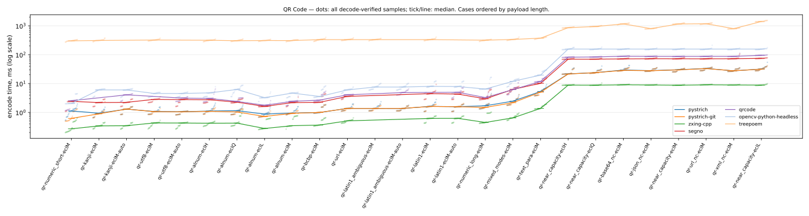
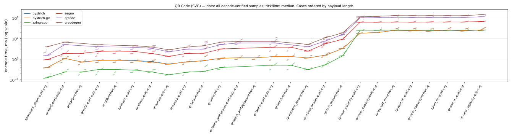

# Barcode encoder benchmark — QR Code

Facts-only report generated by [`barcode-bench publish`](https://github.com/Method-B-Ltd/barcode-bench) — one page per symbology. Every table's ordering and highlighting rule is stated in its caption; narrative and interpretation live elsewhere.

- Run: `20260730T221612Z-seed725059` generated 2026-07-30T22:16:12.748552+00:00
- Corpus: seed 725059, 26 QR Code PNG cases (each mirrored as an SVG twin), 5 trial payloads per case × 5 timed rounds = 25 samples per case per encoder
- Environment: containers on `Linux-7.0.0-28-generic-x86_64-with-glibc2.36`, one image per encoder over a shared `python:3.12-slim-bookworm` base
- CPU: `AMD Ryzen AI 9 HX 370 w/ Radeon 890M` (24 logical cores)

Encoder labels use the exact PyPI distribution name; the **PyPI package** column links each project. `pystrich-git` is a wheel built from GitHub HEAD, not a release.

| encoder | PyPI package | libraries | image id |
|---|---|---|---|
| pystrich | [pystrich](https://pypi.org/project/pystrich/) | pystrich 0.19, pillow 12.3.0 | `ba8fec8cad32` |
| pystrich-git | [pyStrich@HEAD](https://github.com/mmulqueen/pyStrich) (git build, not a release) | pystrich@git 2362f6652978, pillow 12.3.0 | `19e582931615` |
| zxing-cpp | [zxing-cpp](https://pypi.org/project/zxing-cpp/) | zxing-cpp 3.1.1, pillow 12.3.0 | `ff3e163314b8` |
| segno | [segno](https://pypi.org/project/segno/) | segno 1.6.6 | `1c5cf76c09f3` |
| qrcode | [qrcode](https://pypi.org/project/qrcode/) | qrcode 8.2, pillow 12.3.0 | `50ba607a9b6f` |
| qrcodegen | [qrcodegen](https://pypi.org/project/qrcodegen/) | qrcodegen 1.8.0 | `5e2e14b9d105` |
| opencv-python-headless | [opencv-python-headless](https://pypi.org/project/opencv-python-headless/) | opencv-python-headless 5.0.0.93 | `41d394b48a06` |
| treepoem | [treepoem](https://pypi.org/project/treepoem/) | treepoem 3.28.0, pillow 12.3.0, ghostscript 10.00.0 | `0e048434d255` |

## Correctness and coverage

Cases by outcome for this symbology, PNG and SVG axes shown separately: *ok* = every trial decode-verified against its payload (zxing-cpp; SVG rasterised host-side first); *partial* = some trials raised; *misdecode* = the symbol was produced but the reference decoder read it back as different content (a charset-ambiguous byte-mode symbol, say); *err* = every trial raised; *unsup.* = options the encoder cannot honour. Non-ok outcomes are listed under [Exceptions](#exceptions). *Verified symbols* counts decode-verified (symbol, trial) pairs across the PNG and SVG axes.

| encoder | PNG | SVG | verified symbols |
|---|---|---|---:|
| pystrich | 26 ok | 26 ok | 260 |
| pystrich-git | 26 ok | 26 ok | 260 |
| zxing-cpp | 24 ok, 2 misdecode | 24 ok, 2 misdecode | 240 |
| segno | 24 ok, 2 misdecode | 24 ok, 2 misdecode | 240 |
| qrcode | 22 ok, 4 unsup. | 22 ok, 4 unsup. | 220 |
| qrcodegen | 26 unsup. | 22 ok, 4 unsup. | 110 |
| opencv-python-headless | 26 ok | 26 unsup. | 130 |
| treepoem | 22 ok, 4 unsup. | 26 unsup. | 110 |

## Installation size and startup

Encoder stack = full image size minus the shared Python base — i.e. the library plus every dependency it installs, **including Pillow** where the encoder renders through it (segno writes its own PNG/SVG and needs none). Sorted by stack size. Import time is the median of cold interpreter starts inside the container. Footprint is a property of the library, not the symbology; the chart shows the whole field for context.


| encoder | stack MB | full image MB | cold import ms |
|---|---:|---:|---:|
| qrcodegen | 8.6 | 137.7 | 9.54 |
| segno | 9.1 | 138.2 | 26.0 |
| qrcode | 30.1 | 159.2 | 38.1 |
| pystrich | 31.7 | 160.8 | 19.0 |
| pystrich-git | 31.7 | 160.8 | 19.3 |
| zxing-cpp | 31.8 | 160.9 | 18.1 |
| treepoem | 101.3 | 230.4 | 22.2 |
| opencv-python-headless | 238.1 | 367.2 | 69.2 |

## Encode time (PNG)



Median ms of decode-verified samples, rows ordered by payload length. **Bold** = row minimum. `†` = some trials were excluded from the median (raised at encode, or the symbol misdecoded) — see [Exceptions](#exceptions) for which and why. `ERR` = every trial failed (raised, or the symbol misdecoded); `—` = not attempted (unsupported). Chart dots are individual samples (trials × rounds); the tick/line is the median. treepoem's timings include a ghostscript subprocess per encode — part of its cost of use, not an artefact.

| case | payload (chars) | pystrich | pystrich-git | zxing-cpp | segno | qrcode | opencv-python-headless | treepoem |
|---|---|---:|---:|---:|---:|---:|---:|---:|
| `qr-numeric_short-eclM` | numeric_short (9) | 1.12 | 0.62 | **0.27** | 2.40 | 2.53 | 2.04 | 301 |
| `qr-kanji-eclM` | kanji (24) | 0.93 | 0.89 | **0.34** | 2.19 | — | 6.00 | 310 |
| `qr-kanji-eclM-auto` | kanji (24) | 1.30 | 1.30 | **0.35** | 2.22 | 4.04 | 5.99 | — |
| `qr-utf8-eclM` | utf8 (34) | 1.07 | 1.06 | **0.43** | 2.83 | — | 4.52 | 321 |
| `qr-utf8-eclM-auto` | utf8 (34) | 1.05 | 1.04 | **0.43** | 2.78 | 3.13 | 4.51 | — |
| `qr-alnum-eclH` | alnum (36) | 1.11 | 1.09 | **0.42** | 2.72 | 3.03 | 4.74 | 315 |
| `qr-alnum-eclQ` | alnum (37) | 1.15 | 1.03 | **0.42** | 2.25 | 2.40 | 6.22 | 304 |
| `qr-alnum-eclL` | alnum (38) | 0.87 | 0.72 | **0.28** | 1.60 | 1.76 | 3.23 | 309 |
| `qr-alnum-eclM` | alnum (42) | 0.95 | 0.93 | **0.34** | 2.18 | 2.41 | 4.65 | 308 |
| `qr-bcbp-eclM` | bcbp (60) | 0.99 | 1.00 | **0.36** | 2.24 | 2.66 | 3.55 | 332 |
| `qr-url-eclM` | url (68) | 1.38 | 1.36 | **0.51** | 3.58 | 4.06 | 6.00 | 332 |
| `qr-latin1_ambiguous-eclM` | latin1_ambiguous (71) | 1.37 | **1.36** | ERR | ERR | — | 7.54 | 331 |
| `qr-latin1_ambiguous-eclM-auto` | latin1_ambiguous (71) | **1.36** | 1.37 | ERR | ERR | 4.84 | 7.55 | — |
| `qr-latin1-eclM` | latin1 (91) | 1.62 | 1.60 | **0.62** | 4.45 | — | 7.95 | 332 |
| `qr-latin1-eclM-auto` | latin1 (91) | 1.57 | 1.57 | **0.62** | 4.30 | 4.97 | 7.85 | — |
| `qr-numeric_long-eclM` | numeric_long (111) | 1.69 | 1.49 | **0.45** | 2.94 | 3.26 | 6.43 | 317 |
| `qr-mixed_modes-eclM` | mixed_modes (128) | 2.45 | 2.17 | **0.65** | 6.27 | 6.17 | 11.9 | 336 |
| `qr-text_para-eclM` | text_para (237) | 5.31 | 5.03 | **1.38** | 10.2 | 11.8 | 19.6 | 373 |
| `qr-near_capacity-eclH` | near_capacity (1082) | 21.6 | 21.3 | **8.79** | 69.7 | 81.5 | 156 | 859 |
| `qr-near_capacity-eclQ` | near_capacity (1413) | 23.9 | 23.8 | **8.76** | 69.8 | 83.2 | 156 | 947 |
| `qr-base64_nc-eclM` | base64_near_capacity (1980) | 29.4 | 28.6 | **9.01** | 71.3 | 88.2 | 156 | 1,161 |
| `qr-json_nc-eclM` | json_near_capacity (1981) | 28.0 | 27.7 | **8.91** | 72.4 | 87.3 | 156 | 798 |
| `qr-near_capacity-eclM` | near_capacity (1981) | 30.1 | 29.7 | **8.71** | 72.1 | 86.7 | 156 | 1,157 |
| `qr-url_nc-eclM` | url_near_capacity (1981) | 33.2 | 32.9 | **9.00** | 71.8 | 87.3 | 156 | 1,177 |
| `qr-xml_nc-eclM` | xml_near_capacity (1981) | 27.5 | 27.5 | **8.91** | 72.4 | 87.3 | 156 | 796 |
| `qr-near_capacity-eclL` | near_capacity (2510) | 31.8 | 31.5 | **8.81** | 74.5 | 95.0 | 156 | 1,409 |

## Encode time (SVG)



Same conventions and columns as the PNG table above, for SVG output — the *same case set*. Each SVG is rasterised host-side (rsvg-convert, outside the timed region) only for the validity gate, so the timing is the encoder's vector write alone.

| case | payload (chars) | pystrich | pystrich-git | zxing-cpp | segno | qrcode | qrcodegen |
|---|---|---:|---:|---:|---:|---:|---:|
| `qr-numeric_short-eclM-svg` | numeric_short (9) | 0.40 | 0.40 | **0.13** | 0.97 | 1.57 | 4.05 |
| `qr-kanji-eclM-auto-svg` | kanji (24) | 1.10 | 1.10 | **0.24** | 1.92 | 5.13 | 6.83 |
| `qr-kanji-eclM-svg` | kanji (24) | 0.74 | 0.74 | **0.24** | 1.95 | — | — |
| `qr-utf8-eclM-auto-svg` | utf8 (34) | 0.89 | 0.88 | **0.32** | 2.43 | 4.04 | 5.06 |
| `qr-utf8-eclM-svg` | utf8 (34) | 0.90 | 0.89 | **0.32** | 2.50 | — | — |
| `qr-alnum-eclH-svg` | alnum (36) | 0.87 | 0.85 | **0.30** | 2.41 | 3.85 | 4.54 |
| `qr-alnum-eclQ-svg` | alnum (37) | 0.78 | 0.72 | **0.24** | 1.92 | 3.43 | 3.95 |
| `qr-alnum-eclL-svg` | alnum (38) | 0.58 | 0.58 | **0.18** | 1.39 | 2.29 | 2.89 |
| `qr-alnum-eclM-svg` | alnum (42) | 0.75 | 0.74 | **0.23** | 1.92 | 3.10 | 3.89 |
| `qr-bcbp-eclM-svg` | bcbp (60) | 0.85 | 0.87 | **0.26** | 1.97 | 3.17 | 4.56 |
| `qr-url-eclM-svg` | url (68) | 1.12 | 1.14 | **0.40** | 3.18 | 5.24 | 6.84 |
| `qr-latin1_ambiguous-eclM-auto-svg` | latin1_ambiguous (71) | 1.18 | **1.17** | ERR | ERR | 6.18 | 7.40 |
| `qr-latin1_ambiguous-eclM-svg` | latin1_ambiguous (71) | 1.19 | **1.19** | ERR | ERR | — | — |
| `qr-latin1-eclM-auto-svg` | latin1 (91) | 1.35 | 1.35 | **0.52** | 3.87 | 6.27 | 7.46 |
| `qr-latin1-eclM-svg` | latin1 (91) | 1.36 | 1.37 | **0.51** | 3.87 | — | — |
| `qr-numeric_long-eclM-svg` | numeric_long (111) | 1.17 | 1.17 | **0.32** | 2.50 | 4.06 | 5.30 |
| `qr-mixed_modes-eclM-svg` | mixed_modes (128) | 1.60 | 1.56 | **0.54** | 5.74 | 7.73 | 11.1 |
| `qr-text_para-eclM-svg` | text_para (237) | 3.40 | 3.39 | **1.49** | 9.39 | 16.2 | 19.3 |
| `qr-near_capacity-eclH-svg` | near_capacity (1082) | **18.5** | 18.5 | 25.8 | 63.7 | 103 | 115 |
| `qr-near_capacity-eclQ-svg` | near_capacity (1413) | 20.1 | **19.9** | 25.7 | 64.0 | 105 | 123 |
| `qr-base64_nc-eclM-svg` | base64_near_capacity (1980) | 25.5 | **25.4** | 26.1 | 65.3 | 110 | 133 |
| `qr-json_nc-eclM-svg` | json_near_capacity (1981) | **24.4** | 25.0 | 25.9 | 64.3 | 108 | 131 |
| `qr-near_capacity-eclM-svg` | near_capacity (1981) | **23.5** | 23.5 | 25.5 | 65.3 | 108 | 132 |
| `qr-url_nc-eclM-svg` | url_near_capacity (1981) | 25.9 | 26.2 | **25.7** | 65.5 | 108 | 131 |
| `qr-xml_nc-eclM-svg` | xml_near_capacity (1981) | **24.1** | 24.7 | 25.9 | 65.4 | 109 | 131 |
| `qr-near_capacity-eclL-svg` | near_capacity (2510) | 26.9 | 26.9 | **25.6** | 67.8 | 116 | 148 |

## Symbol size

Median module footprint (modules² excluding quiet zones), measured from the rendered symbol's module grid — render scale and quiet zones cancel out, so every encoder is on the same scale. **Bold** = row minimum; percentages are overhead vs it. Only decode-verified symbols are measured: `ERR` = every trial failed (raised, or the symbol misdecoded — see [Exceptions](#exceptions)); `—` = not attempted (unsupported); `†` = measured over a subset of trials (the rest raised or misdecoded). Sizes for qrcodegen are measured from their decoded SVG (SVG-only libraries; the symbol is identical to the PNG a raster encoder would emit).

| case | pystrich | pystrich-git | zxing-cpp | segno | qrcode | qrcodegen | opencv-python-headless | treepoem |
|---|---:|---:|---:|---:|---:|---:|---:|---:|
| `qr-numeric_short-eclM` | **441** | **441** | **441** | **441** | **441** | **441** | **441** | **441** |
| `qr-kanji-eclM` | **841** | **841** | **841** | **841** | — | — | 1,369 (+63%) | **841** |
| `qr-kanji-eclM-auto` | 1,369 (+63%) | 1,369 (+63%) | **841** | **841** | 1,369 (+63%) | 1,369 (+63%) | 1,369 (+63%) | — |
| `qr-utf8-eclM` | **1,089** | **1,089** | **1,089** | **1,089** | — | — | **1,089** | **1,089** |
| `qr-utf8-eclM-auto` | **1,089** | **1,089** | **1,089** | **1,089** | **1,089** | **1,089** | **1,089** | — |
| `qr-alnum-eclH` | **1,089** | **1,089** | **1,089** | **1,089** | **1,089** | **1,089** | **1,089** | **1,089** |
| `qr-alnum-eclQ` | **841** | **841** | **841** | **841** | **841** | **841** | **841** | **841** |
| `qr-alnum-eclL` | **625** | **625** | **625** | **625** | **625** | **625** | **625** | **625** |
| `qr-alnum-eclM` | **841** | **841** | **841** | **841** | **841** | **841** | **841** | **841** |
| `qr-bcbp-eclM` | **841** | **841** | **841** | **841** | **841** | **841** | **841** | **841** |
| `qr-url-eclM` | **1,369** | **1,369** | **1,369** | **1,369** | **1,369** | **1,369** | **1,369** | **1,369** |
| `qr-latin1_ambiguous-eclM` | **1,369** | **1,369** | ERR | ERR | — | — | 1,681 (+23%) | **1,369** |
| `qr-latin1_ambiguous-eclM-auto` | **1,369** | **1,369** | ERR | ERR | 1,681 (+23%) | 1,681 (+23%) | 1,681 (+23%) | — |
| `qr-latin1-eclM` | **1,681** | **1,681** | **1,681** | **1,681** | — | — | **1,681** | **1,681** |
| `qr-latin1-eclM-auto` | **1,681** | **1,681** | **1,681** | **1,681** | **1,681** | **1,681** | **1,681** | — |
| `qr-numeric_long-eclM` | **1,089** | **1,089** | **1,089** | **1,089** | **1,089** | **1,089** | **1,089** | **1,089** |
| `qr-mixed_modes-eclM` | **1,681** | **1,681** | **1,681** | 2,401 (+43%) | 2,025 (+20%) | 2,401 (+43%) | 2,401 (+43%) | **1,681** |
| `qr-text_para-eclM` | **3,721** | **3,721** | **3,721** | **3,721** | **3,721** | **3,721** | **3,721** | **3,721** |
| `qr-near_capacity-eclH` | **27,225** | **27,225** | **27,225** | **27,225** | **27,225** | **27,225** | **27,225** | **27,225** |
| `qr-near_capacity-eclQ` | **27,225** | **27,225** | **27,225** | **27,225** | **27,225** | **27,225** | **27,225** | **27,225** |
| `qr-base64_nc-eclM` | **27,225** | **27,225** | **27,225** | **27,225** | **27,225** | **27,225** | **27,225** | **27,225** |
| `qr-json_nc-eclM` | **27,225** | **27,225** | **27,225** | **27,225** | **27,225** | **27,225** | **27,225** | **27,225** |
| `qr-near_capacity-eclM` | **27,225** | **27,225** | **27,225** | **27,225** | **27,225** | **27,225** | **27,225** | **27,225** |
| `qr-url_nc-eclM` | **27,225** | **27,225** | **27,225** | **27,225** | **27,225** | **27,225** | **27,225** | **27,225** |
| `qr-xml_nc-eclM` | **27,225** | **27,225** | **27,225** | **27,225** | **27,225** | **27,225** | **27,225** | **27,225** |
| `qr-near_capacity-eclL` | **27,225** | **27,225** | **27,225** | **27,225** | **27,225** | **27,225** | **27,225** | **27,225** |

## Exceptions

Every non-ok outcome for this symbology: unsupported options and encode errors carry the recorded reason verbatim; a *misdecode* (the symbol was produced but failed the decode-verify gate) shows how it failed.

| encoder | case | outcome | trials | reason |
|---|---|---|---:|---|
| opencv-python-headless | `qr-alnum-eclH-svg` | unsupported | 5 | no native SVG writer |
| opencv-python-headless | `qr-alnum-eclL-svg` | unsupported | 5 | no native SVG writer |
| opencv-python-headless | `qr-alnum-eclM-svg` | unsupported | 5 | no native SVG writer |
| opencv-python-headless | `qr-alnum-eclQ-svg` | unsupported | 5 | no native SVG writer |
| opencv-python-headless | `qr-base64_nc-eclM-svg` | unsupported | 5 | no native SVG writer |
| opencv-python-headless | `qr-bcbp-eclM-svg` | unsupported | 5 | no native SVG writer |
| opencv-python-headless | `qr-json_nc-eclM-svg` | unsupported | 5 | no native SVG writer |
| opencv-python-headless | `qr-kanji-eclM-auto-svg` | unsupported | 5 | no native SVG writer |
| opencv-python-headless | `qr-kanji-eclM-svg` | unsupported | 5 | no native SVG writer |
| opencv-python-headless | `qr-latin1-eclM-auto-svg` | unsupported | 5 | no native SVG writer |
| opencv-python-headless | `qr-latin1-eclM-svg` | unsupported | 5 | no native SVG writer |
| opencv-python-headless | `qr-latin1_ambiguous-eclM-auto-svg` | unsupported | 5 | no native SVG writer |
| opencv-python-headless | `qr-latin1_ambiguous-eclM-svg` | unsupported | 5 | no native SVG writer |
| opencv-python-headless | `qr-mixed_modes-eclM-svg` | unsupported | 5 | no native SVG writer |
| opencv-python-headless | `qr-near_capacity-eclH-svg` | unsupported | 5 | no native SVG writer |
| opencv-python-headless | `qr-near_capacity-eclL-svg` | unsupported | 5 | no native SVG writer |
| opencv-python-headless | `qr-near_capacity-eclM-svg` | unsupported | 5 | no native SVG writer |
| opencv-python-headless | `qr-near_capacity-eclQ-svg` | unsupported | 5 | no native SVG writer |
| opencv-python-headless | `qr-numeric_long-eclM-svg` | unsupported | 5 | no native SVG writer |
| opencv-python-headless | `qr-numeric_short-eclM-svg` | unsupported | 5 | no native SVG writer |
| opencv-python-headless | `qr-text_para-eclM-svg` | unsupported | 5 | no native SVG writer |
| opencv-python-headless | `qr-url-eclM-svg` | unsupported | 5 | no native SVG writer |
| opencv-python-headless | `qr-url_nc-eclM-svg` | unsupported | 5 | no native SVG writer |
| opencv-python-headless | `qr-utf8-eclM-auto-svg` | unsupported | 5 | no native SVG writer |
| opencv-python-headless | `qr-utf8-eclM-svg` | unsupported | 5 | no native SVG writer |
| opencv-python-headless | `qr-xml_nc-eclM-svg` | unsupported | 5 | no native SVG writer |
| qrcode | `qr-kanji-eclM` | unsupported | 5 | no charset/ECI support for 'shift_jis' payloads |
| qrcode | `qr-kanji-eclM-svg` | unsupported | 5 | no charset/ECI support for 'shift_jis' payloads |
| qrcode | `qr-latin1-eclM` | unsupported | 5 | no charset/ECI support for 'iso-8859-1' payloads |
| qrcode | `qr-latin1-eclM-svg` | unsupported | 5 | no charset/ECI support for 'iso-8859-1' payloads |
| qrcode | `qr-latin1_ambiguous-eclM` | unsupported | 5 | no charset/ECI support for 'iso-8859-1' payloads |
| qrcode | `qr-latin1_ambiguous-eclM-svg` | unsupported | 5 | no charset/ECI support for 'iso-8859-1' payloads |
| qrcode | `qr-utf8-eclM` | unsupported | 5 | no charset/ECI support for 'utf-8' payloads |
| qrcode | `qr-utf8-eclM-svg` | unsupported | 5 | no charset/ECI support for 'utf-8' payloads |
| qrcodegen | `qr-alnum-eclH` | unsupported | 5 | no documented raster output (vector-only library) |
| qrcodegen | `qr-alnum-eclL` | unsupported | 5 | no documented raster output (vector-only library) |
| qrcodegen | `qr-alnum-eclM` | unsupported | 5 | no documented raster output (vector-only library) |
| qrcodegen | `qr-alnum-eclQ` | unsupported | 5 | no documented raster output (vector-only library) |
| qrcodegen | `qr-base64_nc-eclM` | unsupported | 5 | no documented raster output (vector-only library) |
| qrcodegen | `qr-bcbp-eclM` | unsupported | 5 | no documented raster output (vector-only library) |
| qrcodegen | `qr-json_nc-eclM` | unsupported | 5 | no documented raster output (vector-only library) |
| qrcodegen | `qr-kanji-eclM` | unsupported | 5 | no documented raster output (vector-only library) |
| qrcodegen | `qr-kanji-eclM-auto` | unsupported | 5 | no documented raster output (vector-only library) |
| qrcodegen | `qr-kanji-eclM-svg` | unsupported | 5 | no charset/ECI support for 'shift_jis' payloads |
| qrcodegen | `qr-latin1-eclM` | unsupported | 5 | no documented raster output (vector-only library) |
| qrcodegen | `qr-latin1-eclM-auto` | unsupported | 5 | no documented raster output (vector-only library) |
| qrcodegen | `qr-latin1-eclM-svg` | unsupported | 5 | no charset/ECI support for 'iso-8859-1' payloads |
| qrcodegen | `qr-latin1_ambiguous-eclM` | unsupported | 5 | no documented raster output (vector-only library) |
| qrcodegen | `qr-latin1_ambiguous-eclM-auto` | unsupported | 5 | no documented raster output (vector-only library) |
| qrcodegen | `qr-latin1_ambiguous-eclM-svg` | unsupported | 5 | no charset/ECI support for 'iso-8859-1' payloads |
| qrcodegen | `qr-mixed_modes-eclM` | unsupported | 5 | no documented raster output (vector-only library) |
| qrcodegen | `qr-near_capacity-eclH` | unsupported | 5 | no documented raster output (vector-only library) |
| qrcodegen | `qr-near_capacity-eclL` | unsupported | 5 | no documented raster output (vector-only library) |
| qrcodegen | `qr-near_capacity-eclM` | unsupported | 5 | no documented raster output (vector-only library) |
| qrcodegen | `qr-near_capacity-eclQ` | unsupported | 5 | no documented raster output (vector-only library) |
| qrcodegen | `qr-numeric_long-eclM` | unsupported | 5 | no documented raster output (vector-only library) |
| qrcodegen | `qr-numeric_short-eclM` | unsupported | 5 | no documented raster output (vector-only library) |
| qrcodegen | `qr-text_para-eclM` | unsupported | 5 | no documented raster output (vector-only library) |
| qrcodegen | `qr-url-eclM` | unsupported | 5 | no documented raster output (vector-only library) |
| qrcodegen | `qr-url_nc-eclM` | unsupported | 5 | no documented raster output (vector-only library) |
| qrcodegen | `qr-utf8-eclM` | unsupported | 5 | no documented raster output (vector-only library) |
| qrcodegen | `qr-utf8-eclM-auto` | unsupported | 5 | no documented raster output (vector-only library) |
| qrcodegen | `qr-utf8-eclM-svg` | unsupported | 5 | no charset/ECI support for 'utf-8' payloads |
| qrcodegen | `qr-xml_nc-eclM` | unsupported | 5 | no documented raster output (vector-only library) |
| segno | `qr-latin1_ambiguous-eclM` | misdecode | 5 | 5 decoded to different content (read back e.g. `ｶ route amount ｣88 ､742 ｣26603 ｣2125 ､84…`) |
| segno | `qr-latin1_ambiguous-eclM-auto` | misdecode | 5 | 5 decoded to different content (read back e.g. `ｶ route amount ｣88 ､742 ｣26603 ｣2125 ､84…`) |
| segno | `qr-latin1_ambiguous-eclM-auto-svg` | misdecode | 5 | 5 decoded to different content (read back e.g. `ｶ route amount ｣88 ､742 ｣26603 ｣2125 ､84…`) |
| segno | `qr-latin1_ambiguous-eclM-svg` | misdecode | 5 | 5 decoded to different content (read back e.g. `ｶ route amount ｣88 ､742 ｣26603 ｣2125 ､84…`) |
| treepoem | `qr-alnum-eclH-svg` | unsupported | 5 | no native SVG writer |
| treepoem | `qr-alnum-eclL-svg` | unsupported | 5 | no native SVG writer |
| treepoem | `qr-alnum-eclM-svg` | unsupported | 5 | no native SVG writer |
| treepoem | `qr-alnum-eclQ-svg` | unsupported | 5 | no native SVG writer |
| treepoem | `qr-base64_nc-eclM-svg` | unsupported | 5 | no native SVG writer |
| treepoem | `qr-bcbp-eclM-svg` | unsupported | 5 | no native SVG writer |
| treepoem | `qr-json_nc-eclM-svg` | unsupported | 5 | no native SVG writer |
| treepoem | `qr-kanji-eclM-auto` | unsupported | 5 | cannot take non-ASCII text without a declared charset |
| treepoem | `qr-kanji-eclM-auto-svg` | unsupported | 5 | no native SVG writer |
| treepoem | `qr-kanji-eclM-svg` | unsupported | 5 | no native SVG writer |
| treepoem | `qr-latin1-eclM-auto` | unsupported | 5 | cannot take non-ASCII text without a declared charset |
| treepoem | `qr-latin1-eclM-auto-svg` | unsupported | 5 | no native SVG writer |
| treepoem | `qr-latin1-eclM-svg` | unsupported | 5 | no native SVG writer |
| treepoem | `qr-latin1_ambiguous-eclM-auto` | unsupported | 5 | cannot take non-ASCII text without a declared charset |
| treepoem | `qr-latin1_ambiguous-eclM-auto-svg` | unsupported | 5 | no native SVG writer |
| treepoem | `qr-latin1_ambiguous-eclM-svg` | unsupported | 5 | no native SVG writer |
| treepoem | `qr-mixed_modes-eclM-svg` | unsupported | 5 | no native SVG writer |
| treepoem | `qr-near_capacity-eclH-svg` | unsupported | 5 | no native SVG writer |
| treepoem | `qr-near_capacity-eclL-svg` | unsupported | 5 | no native SVG writer |
| treepoem | `qr-near_capacity-eclM-svg` | unsupported | 5 | no native SVG writer |
| treepoem | `qr-near_capacity-eclQ-svg` | unsupported | 5 | no native SVG writer |
| treepoem | `qr-numeric_long-eclM-svg` | unsupported | 5 | no native SVG writer |
| treepoem | `qr-numeric_short-eclM-svg` | unsupported | 5 | no native SVG writer |
| treepoem | `qr-text_para-eclM-svg` | unsupported | 5 | no native SVG writer |
| treepoem | `qr-url-eclM-svg` | unsupported | 5 | no native SVG writer |
| treepoem | `qr-url_nc-eclM-svg` | unsupported | 5 | no native SVG writer |
| treepoem | `qr-utf8-eclM-auto` | unsupported | 5 | cannot take non-ASCII text without a declared charset |
| treepoem | `qr-utf8-eclM-auto-svg` | unsupported | 5 | no native SVG writer |
| treepoem | `qr-utf8-eclM-svg` | unsupported | 5 | no native SVG writer |
| treepoem | `qr-xml_nc-eclM-svg` | unsupported | 5 | no native SVG writer |
| zxing-cpp | `qr-latin1_ambiguous-eclM` | misdecode | 5 | 5 decoded to different content (read back e.g. `ｶ route amount ｣88 ､742 ｣26603 ｣2125 ､84…`) |
| zxing-cpp | `qr-latin1_ambiguous-eclM-auto` | misdecode | 5 | 5 decoded to different content (read back e.g. `ｶ route amount ｣88 ､742 ｣26603 ｣2125 ､84…`) |
| zxing-cpp | `qr-latin1_ambiguous-eclM-auto-svg` | misdecode | 5 | 5 decoded to different content (read back e.g. `ｶ route amount ｣88 ､742 ｣26603 ｣2125 ､84…`) |
| zxing-cpp | `qr-latin1_ambiguous-eclM-svg` | misdecode | 5 | 5 decoded to different content (read back e.g. `ｶ route amount ｣88 ､742 ｣26603 ｣2125 ､84…`) |

## Methodology

- **One corpus, all encoders.** Payloads are generated once per run from a seeded RNG and materialised to `corpus.json`; every encoder receives the identical byte-for-byte payloads. The same seed reproduces the corpus exactly.
- **Same environment.** Every encoder runs in its own podman image over the same pinned Python base; libraries install from PyPI as published (except `pystrich-git`, a wheel from GitHub HEAD).
- **What is timed.** The full operation *payload string → encode → image on disk*, `perf_counter`, after one untimed warm-up per option shape. Import cost is excluded and measured separately (cold-import column). Each encoder renders through the writer its own documentation shows; a library that documents no raster path runs the SVG axis only rather than being forced through a foreign shim (noted per encoder in the run's capability notes).
- **Same cases, both formats.** Every PNG case has an SVG twin with byte-identical payloads. SVG rasterisation and measurement happen host-side, outside the timed region, so SVG timing is the encoder's vector write alone; the module footprint is identical for a case and its SVG twin, so it is reported once.
- **Validity gate.** Every produced image (PNG, or SVG rasterised host-side) is decoded with zxing-cpp and compared to its payload; samples from failed round-trips are excluded from all statistics.
- **Explicit options, never degraded.** Cases request explicit EC levels / charsets; an encoder that cannot honour a knob is recorded *unsupported* rather than silently re-configured.

## Limitations

Not measured: print/scan robustness or decode margins, output file size (PNG compression / SVG verbosity), memory use, concurrency, or cross-platform variation. Timings are sequential on one machine — treat small differences accordingly; the charts draw every raw sample so the spread is visible.

Symbol area is quantised: a symbol is the smallest standard size that fits its payload, so differences smaller than one size tier don't appear in the tables.

treepoem shells out to ghostscript once per encode; its timings are orders of magnitude larger by construction — the cost of that approach, kept in the tables rather than hidden.

Benchmark authored by the maintainer of pyStrich; the corpus and validity rules are encoder-neutral and the raw records ship alongside this report.

## Reproduction

Benchmark source: [Method-B-Ltd/barcode-bench](https://github.com/Method-B-Ltd/barcode-bench).

```sh
uv run barcode-bench all --seed 725059 --trials 5
```

Raw records alongside this report: [`corpus.json`](corpus.json), [`summary.csv`](summary.csv), [`measurements.jsonl`](measurements.jsonl), [`images.json`](images.json).
